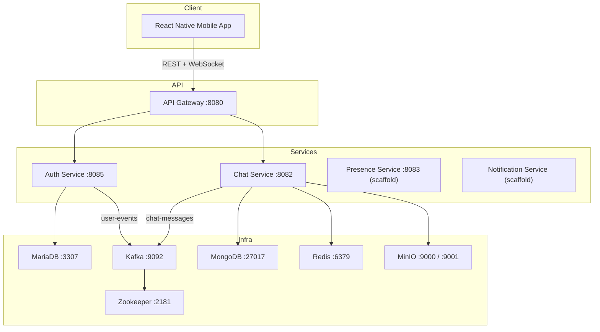
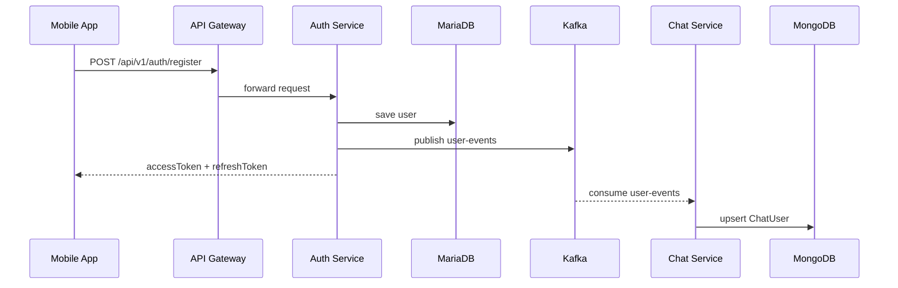
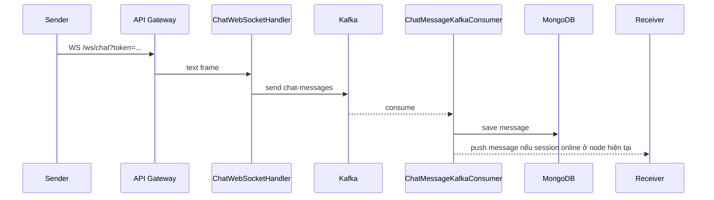

# IUH Connect

> Ứng dụng chat cho môi trường đại học, xây theo kiến trúc microservices với frontend React Native và backend Spring Boot.

## 1. Mục đích của tài liệu này

`README.md` này được viết theo hướng:

- người mới vào project chỉ cần đọc một file là hiểu bức tranh toàn bộ
- phân biệt rõ phần nào đang chạy thật, phần nào chỉ là prototype, phần nào mới là kế hoạch
- giúp nhóm phát triển, giảng viên hướng dẫn hoặc người review không phải tự đọc toàn bộ source code để hiểu hệ thống

## 2. Tóm tắt dự án

IUH Connect là một hệ thống giao tiếp nội bộ cho sinh viên và giảng viên, tập trung vào:

- đăng ký / đăng nhập người dùng
- quản lý hồ sơ cá nhân
- danh bạ và kết bạn
- chat thời gian thực
- upload file/media qua MinIO
- nền tảng mở rộng cho presence, notification và meeting/video call

Project hiện gồm 2 khối lớn:

- `frontend/`: app mobile React Native chạy chủ yếu cho Android
- `backend/`: các service Spring Boot theo mô hình microservices

## 3. Thành phần trong repository

```text
BaiTapLon/
├── backend/
│   ├── api-gateway/
│   ├── auth-service/
│   ├── chat-service/
│   ├── notification-service/
│   └── presence-service/
├── frontend/
├── docker-compose.yml
├── README.md
├── implementation_plan.md
├── implementation_plan_part1.md
├── implementation_plan_part2.md
└── implementation_plan_meeting.md
```

Giải thích nhanh:

- `api-gateway`: route tất cả REST và WebSocket vào các service tương ứng
- `auth-service`: auth, JWT, user profile, contact/friendship
- `chat-service`: chat realtime, Kafka pipeline, MongoDB, MinIO, Redis signaling/presence
- `presence-service`: service scaffold, hiện chưa có nghiệp vụ thật
- `notification-service`: service scaffold, hiện chưa có nghiệp vụ thật
- `implementation_plan_meeting.md`: kế hoạch chuẩn hóa lại tính năng meeting/handoff từ mobile sang desktop

## 4. Trạng thái thực tế của project

### 4.1. Phần đang hoạt động

- đăng ký và đăng nhập với JWT
- lấy và cập nhật hồ sơ cá nhân
- gửi lời mời kết bạn, chấp nhận kết bạn, lấy danh sách bạn bè
- chat thời gian thực qua WebSocket
- lưu message vào MongoDB qua Kafka consumer
- lấy lịch sử chat và hội thoại gần đây
- sinh presigned URL để upload file trực tiếp lên MinIO
- presence cơ bản theo Redis trong `chat-service`
- signaling prototype cho video call / WebRTC kiểu cũ trong `chat-service`

### 4.2. Phần có trong code nhưng chưa ổn định / chưa production-ready

- video call hiện tại
- cross-device handoff sang desktop
- signaling meeting tách biệt khỏi chat
- đa instance chat không duplicate message
- presence-service riêng biệt
- notification-service riêng biệt

### 4.3. Phần mới là kế hoạch

Kế hoạch meeting mới đang nằm ở:

- [implementation_plan_meeting.md](D:/Study/KienTruc/BaiTapLon/implementation_plan_meeting.md:1)

Mục tiêu của plan này là:

- bỏ luồng video call chắp vá hiện tại
- dùng Jitsi cho media
- tách `CALL_SIGNAL` khỏi chat
- cho phép chuyển cuộc họp từ mobile sang desktop web để chia sẻ màn hình

## 5. Kiến trúc triển khai hiện tại



## 6. Kiến trúc logic theo service

### 6.1. API Gateway

Vai trò:

- là entry point duy nhất cho mobile app
- route HTTP cho auth/contact/user/chat
- route WebSocket `/ws/chat/**` vào `chat-service`

File chính:

- [backend/api-gateway/src/main/resources/application.yml](D:/Study/KienTruc/BaiTapLon/backend/api-gateway/src/main/resources/application.yml:1)
- [backend/api-gateway/src/main/java/com/iuhconnect/gateway/ApiGatewayApplication.java](D:/Study/KienTruc/BaiTapLon/backend/api-gateway/src/main/java/com/iuhconnect/gateway/ApiGatewayApplication.java:1)

### 6.2. Auth Service

Vai trò:

- đăng ký / đăng nhập
- sinh JWT
- đọc và cập nhật hồ sơ user
- quản lý friend request / contacts
- publish `user-events` lên Kafka để `chat-service` sync read-model

Thành phần chính:

- `AuthController`, `AuthService`
- `UserController`, `UserService`
- `ContactController`, `ContactService`
- `JwtAuthenticationFilter`, `JwtTokenProvider`
- `UserRepository`, `FriendshipRepository`

Persistence:

- MariaDB

### 6.3. Chat Service

Vai trò:

- mở WebSocket endpoint `/ws/chat`
- nhận message realtime từ client
- route chat message vào Kafka
- consumer Kafka để lưu MongoDB và push lại WebSocket
- đồng bộ `ChatUser` từ `user-events`
- cấp presigned URL upload file qua MinIO
- giữ presence và signaling Redis trong cùng service

Thành phần chính:

- `ChatWebSocketHandler`
- `WebSocketSessionManager`
- `ChatMessageKafkaConsumer`
- `UserEventConsumer`
- `MessageService`
- `ChatController`
- `FileUploadController`
- `PresenceService`
- `SignalingRedisSubscriber`
- `RedisSignalingConfig`

Persistence / infra:

- MongoDB cho message và chat user
- Redis cho presence và signaling cross-instance
- Kafka cho pipeline chat
- MinIO cho upload media

### 6.4. Presence Service riêng

`backend/presence-service/` hiện mới chỉ có bootstrap app.

Điều quan trọng:

- project có **module `presence-service` riêng**
- nhưng **presence logic đang dùng thật lại nằm trong `chat-service`**

Nói cách khác:

- `presence-service` module: chưa hoàn thiện
- `PresenceService` class trong `chat-service`: đang được dùng thật

### 6.5. Notification Service riêng

`backend/notification-service/` hiện cũng mới là scaffold.

Hiện chưa có:

- consumer nghiệp vụ ổn định
- FCM flow đầy đủ
- API hay worker flow hoàn chỉnh

## 7. Luồng dữ liệu chính

### 7.1. Luồng đăng ký người dùng



### 7.2. Luồng chat realtime



### 7.3. Luồng signaling video call hiện tại

Luồng này đang tồn tại trong code, nhưng **chưa phải giải pháp cuối cùng**.

Hiện trạng:

- frontend `VideoCallScreen` không làm WebRTC native hoàn chỉnh
- frontend gửi signaling kiểu `type = "WEBRTC"` qua cùng WebSocket `/ws/chat`
- `ChatWebSocketHandler` phân nhánh `WEBRTC` để relay signal
- nếu receiver ở node khác, `chat-service` dùng Redis Pub/Sub để route
- sau đó frontend mở Jitsi bằng browser / deep link

Luồng này mang tính prototype:

- có signaling riêng
- có presence Redis
- có route qua `SignalingRedisSubscriber`
- nhưng chưa ổn định để coi là production-ready

## 8. Tính năng meeting / video call hiện tại

### 8.1. Thực tế đang có trong code

Màn hình:

- [frontend/src/screens/VideoCallScreen.tsx](D:/Study/KienTruc/BaiTapLon/frontend/src/screens/VideoCallScreen.tsx:1)

Điểm chính:

- màn chat có nút camera
- khi bấm gọi, app điều hướng sang `VideoCallScreen`
- `VideoCallScreen` mở signaling qua WebSocket
- nếu đối phương accept, app mở Jitsi room bằng `Linking.openURL(...)`

### 8.2. Tại sao chưa ổn

Các vấn đề hiện tại:

- signaling đang đi chung đường với chat
- contract `WEBRTC` chưa tách bạch với contract chat
- UX nhận cuộc gọi vẫn phụ thuộc nhiều vào trạng thái màn hình hiện tại
- không có cross-device handoff chuẩn cho desktop
- media thật đang nằm ngoài app qua Jitsi nên lifecycle khó đồng bộ

### 8.3. Hướng xử lý đã thống nhất

Tính năng này sẽ được làm lại theo plan mới:

- dùng `CALL_SIGNAL` thay cho `WEBRTC`
- tách meeting khỏi chat
- vẫn dùng Jitsi làm media engine
- thêm desktop web tối giản để chuyển cuộc họp từ mobile sang máy tính

Tài liệu thiết kế:

- [implementation_plan_meeting.md](D:/Study/KienTruc/BaiTapLon/implementation_plan_meeting.md:1)

## 9. Mapping giữa code và chức năng

### 9.1. Backend

| Chức năng | File chính |
| --- | --- |
| Route gateway | `backend/api-gateway/src/main/resources/application.yml` |
| Đăng ký / đăng nhập | `backend/auth-service/.../controller/AuthController.java`, `.../service/AuthService.java` |
| Hồ sơ cá nhân | `backend/auth-service/.../controller/UserController.java`, `.../service/UserService.java` |
| Kết bạn / danh bạ | `backend/auth-service/.../controller/ContactController.java`, `.../service/ContactService.java` |
| JWT filter | `backend/auth-service/.../security/JwtAuthenticationFilter.java` |
| WebSocket chat | `backend/chat-service/.../handler/ChatWebSocketHandler.java` |
| Session WebSocket | `backend/chat-service/.../handler/WebSocketSessionManager.java` |
| Consumer lưu message | `backend/chat-service/.../consumer/ChatMessageKafkaConsumer.java` |
| Consumer sync user | `backend/chat-service/.../consumer/UserEventConsumer.java` |
| Presence Redis | `backend/chat-service/.../service/PresenceService.java` |
| Redis signaling subscriber | `backend/chat-service/.../handler/SignalingRedisSubscriber.java` |
| Redis signaling config | `backend/chat-service/.../config/RedisSignalingConfig.java` |
| API lịch sử chat | `backend/chat-service/.../controller/ChatController.java` |
| Presigned URL upload | `backend/chat-service/.../controller/FileUploadController.java` |

### 9.2. Frontend

| Màn hình / use case | File chính |
| --- | --- |
| App shell / navigation | `frontend/App.tsx` |
| Login / Register | `frontend/src/screens/LoginScreen.tsx` |
| Danh sách hội thoại | `frontend/src/screens/ChatListScreen.tsx` |
| Màn chat | `frontend/src/screens/ChatScreen.tsx` |
| Danh bạ / kết bạn | `frontend/src/screens/ContactsScreen.tsx` |
| Hồ sơ cá nhân | `frontend/src/screens/ProfileSettingsScreen.tsx` |
| Video call prototype | `frontend/src/screens/VideoCallScreen.tsx` |
| Màn demo home | `frontend/src/screens/HomeScreen.tsx` |
| Màn demo groups | `frontend/src/screens/GroupsScreen.tsx` |
| Config backend URL | `frontend/src/config/env.ts` |

## 10. API hiện có

### 10.1. Auth / User / Contact

Đi qua gateway:

- `POST /api/v1/auth/register`
- `POST /api/v1/auth/login`
- `GET /api/v1/users/me`
- `PUT /api/v1/users/me`
- `POST /api/v1/contacts/request?targetUsername=<username>`
- `POST /api/v1/contacts/accept?senderUsername=<username>`
- `GET /api/v1/contacts/pending`
- `GET /api/v1/contacts/list`

### 10.2. Chat / File

- `GET /api/v1/chat/history/{conversationId}`
- `GET /api/v1/chat/conversations/{userId}`
- `GET /api/v1/files/presigned-url?fileName=<name>&contentType=<type>`
- `WS /ws/chat?token=<jwt>`

### 10.3. Payload chat WebSocket

```json
{
  "senderId": "user1",
  "receiverId": "user2",
  "content": "Hello",
  "conversationId": "user1-user2",
  "timestamp": 1711234567890
}
```

### 10.4. Payload signaling prototype hiện tại

```json
{
  "type": "WEBRTC",
  "senderId": "user1",
  "receiverId": "user2",
  "signalType": "CALL_INVITE",
  "payload": {}
}
```

Lưu ý:

- đây là contract tạm thời / prototype
- contract này dự kiến sẽ bị thay bằng `CALL_SIGNAL` trong redesign meeting

## 11. Frontend hiện đang làm gì

### 11.1. Màn đã nối backend thật

- `LoginScreen`: login/register
- `ChatScreen`: history + WebSocket chat
- `ChatListScreen`: conversations
- `ContactsScreen`: contact APIs
- `ProfileSettingsScreen`: user profile APIs

### 11.2. Màn chủ yếu là demo UI

- `HomeScreen`
- `GroupsScreen`
- một phần `VideoCallScreen`

## 12. Hạ tầng và công nghệ

| Tầng | Công nghệ |
| --- | --- |
| Mobile app | React Native 0.73 |
| Navigation | React Navigation |
| Chat UI | `react-native-gifted-chat` |
| Backend | Spring Boot 3.2, Java 17 |
| Auth | Spring Security + JWT (`jjwt`) |
| Message broker | Kafka + Zookeeper |
| DB quan hệ | MariaDB 11 |
| DB document | MongoDB 7 |
| Cache / presence / signaling | Redis 7.2 |
| Object storage | MinIO |
| Containerization | Docker Compose |

## 13. Cấu hình môi trường local

### 13.1. Docker services

Khi chạy `docker-compose up --build -d`, hệ thống sẽ tạo:

- `iuh-zookeeper`
- `iuh-kafka`
- `iuh-mariadb`
- `iuh-mongodb`
- `iuh-redis`
- `iuh-minio`
- `iuh-auth-service`
- `iuh-chat-service`
- `iuh-api-gateway`
- `iuh-presence-service`
- `iuh-notification-service`

### 13.2. Port

| Thành phần | Port |
| --- | --- |
| API Gateway | `8080` |
| Auth Service | `8085` |
| Chat Service | `8082` |
| Presence Service | `8083` |
| Zookeeper | `2181` |
| Kafka | `9092` |
| MariaDB | `3307` |
| MongoDB | `27017` |
| Redis | `6379` |
| MinIO API | `9000` |
| MinIO Console | `9001` |

### 13.3. Credential local

| Thành phần | Giá trị |
| --- | --- |
| MariaDB root password | `root123` |
| MariaDB database | `auth_db` |
| MariaDB user / password | `iuh_user` / `iuh_pass` |
| MongoDB admin | `iuh_admin` / `iuh_mongo_pass` |
| Redis password | `iuh_redis_pass` |
| MinIO root | `iuh_minio_admin` / `iuh_minio_password` |
| JWT secret | `IUHConnectSuperSecretKeyForJWT2024MustBeAtLeast256BitsLong!!` |

## 14. Cách chạy project

### 14.1. Chạy backend + infra

```bash
docker-compose up --build -d
```

Kiểm tra:

```bash
docker ps -a --filter "name=iuh" --format "table {{.Names}}\t{{.Status}}\t{{.Ports}}"
```

### 14.2. Test nhanh auth

Đăng ký:

```bash
curl -X POST http://localhost:8080/api/v1/auth/register \
  -H "Content-Type: application/json" \
  -d "{\"username\":\"testuser\",\"password\":\"123456\",\"fullName\":\"Test User\",\"email\":\"test@example.com\"}"
```

Đăng nhập:

```bash
curl -X POST http://localhost:8080/api/v1/auth/login \
  -H "Content-Type: application/json" \
  -d "{\"username\":\"testuser\",\"password\":\"123456\"}"
```

Health gateway:

```bash
curl http://localhost:8080/actuator/health
```

### 14.3. Chạy frontend

```bash
cd frontend
npm install
npx react-native start
```

Ở terminal khác:

```bash
npx react-native run-android
```

## 15. Lưu ý cấu hình frontend

File:

- [frontend/src/config/env.ts](D:/Study/KienTruc/BaiTapLon/frontend/src/config/env.ts:1)

Điểm quan trọng:

- app hiện đang dùng `SERVER_IP` hardcode
- trên máy thật hoặc emulator khác môi trường, cần đổi lại IP LAN đúng của máy đang chạy backend

Ví dụ:

- emulator Android: có thể dùng `10.0.2.2`
- máy thật: phải đổi sang IP LAN của máy dev, ví dụ `192.168.x.x`

Nếu quên đổi:

- login không vào
- WebSocket không kết nối
- video call / signaling prototype không hoạt động

## 16. Hạn chế hiện tại

### 16.1. Chat / realtime

- pipeline Kafka hiện tại có nguy cơ duplicate khi scale nhiều instance `chat-service`
- session manager hiện thiên về 1 session / 1 user
- logic broadcast và logic persistence còn dính nhau trong `ChatMessageKafkaConsumer`

### 16.2. Presence / signaling

- presence thật đang nằm trong `chat-service`, chưa tách thành service riêng hoàn chỉnh
- signaling video call hiện là prototype kiểu `WEBRTC`
- signaling vẫn đi chung endpoint `/ws/chat`

### 16.3. Meeting / video call

- chưa có meeting module độc lập
- chưa có handoff chuẩn từ mobile sang desktop
- Jitsi chỉ mới được dùng như giải pháp mở browser ngoài
- lifecycle cuộc gọi chưa đồng bộ tốt giữa app và media session thực tế

### 16.4. Frontend

- một số màn còn là mock/demo
- chưa có global incoming call coordinator
- config môi trường đang phụ thuộc chỉnh tay IP

## 17. Hướng phát triển đã thống nhất

Hướng đi đã được chốt cho tính năng meeting:

- không tiếp tục đẩy WebRTC native custom
- dùng Jitsi cho media
- tách `CALL_SIGNAL` khỏi chat
- tạo `MeetingScreen` riêng
- thêm desktop web tối giản để join cùng cuộc họp từ máy tính
- cho phép giảng viên chuyển thiết bị sang desktop để chia sẻ màn hình thuận tiện hơn

Tài liệu thiết kế chính:

- [implementation_plan_meeting.md](D:/Study/KienTruc/BaiTapLon/implementation_plan_meeting.md:1)

## 18. Kết luận

Hiện tại project đã có nền tảng backend/frontend khá đầy đủ cho:

- auth
- profile
- contacts
- chat realtime
- upload media

Phần video call / meeting đang ở trạng thái prototype và là khu vực cần refactor lớn tiếp theo. Người đọc nên hiểu dự án theo 3 lớp:

1. `Đang chạy tốt`: auth, profile, contacts, chat, upload
2. `Đang tồn tại trong code nhưng chưa ổn`: signaling/video call prototype
3. `Định hướng sắp làm`: meeting module + desktop handoff theo `implementation_plan_meeting.md`
