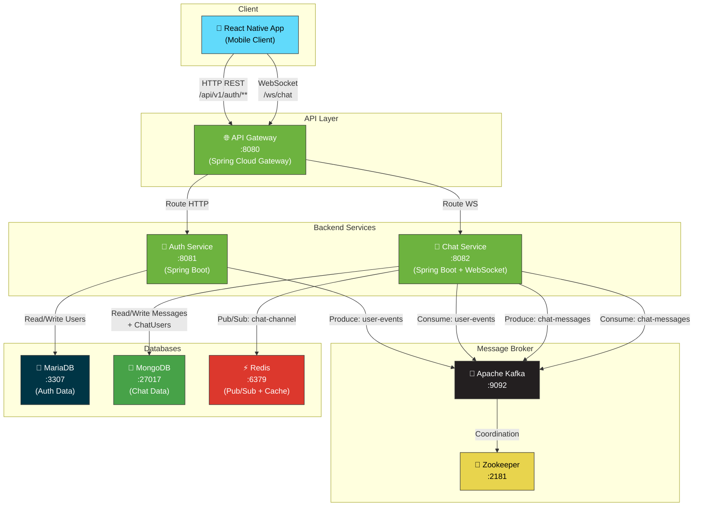
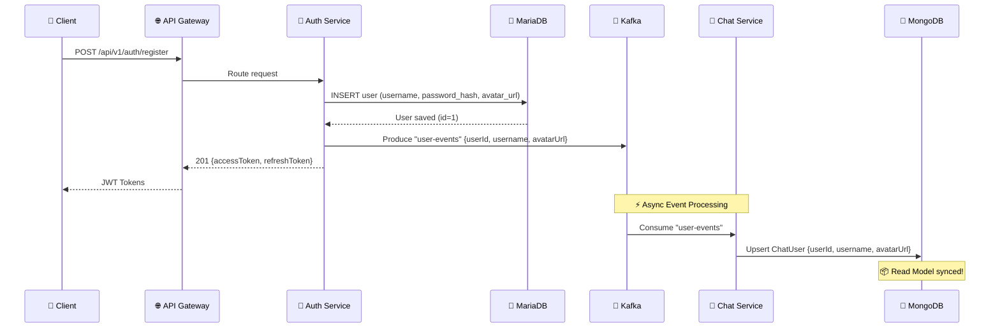
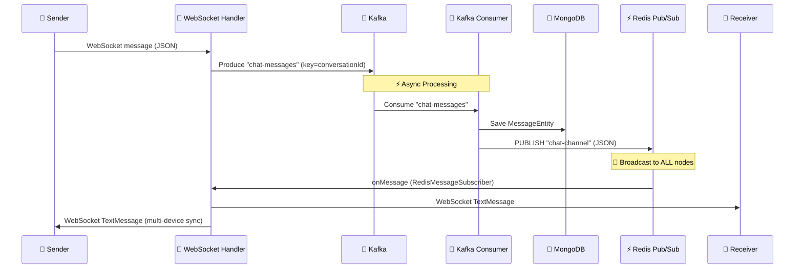

# 🎓 IUH Connect — Real-time Chat Platform

> Microservices + Event-Driven Architecture

---

## 📖 Project Overview

**IUH Connect** là một nền tảng nhắn tin thời gian thực được xây dựng trên kiến trúc **Microservices** kết hợp **Event-Driven Architecture**. Hệ thống được thiết kế để đảm bảo:

- **Loose Coupling**: Các service giao tiếp bất đồng bộ qua Apache Kafka.
- **Scalability**: Hỗ trợ multi-node WebSocket thông qua Redis Pub/Sub.
- **Security**: Xác thực bằng JWT stateless, mã hóa mật khẩu với BCrypt.
- **CQRS Pattern**: Dữ liệu người dùng được ghi vào MariaDB (Write Model) và đồng bộ sang MongoDB (Read Model) thông qua Kafka events.

---

## 🏗️ System Architecture



---

## ⚡ Event-Driven Architecture

Hệ thống sử dụng **Apache Kafka** làm Message Broker trung tâm và **Redis Pub/Sub** cho broadcast real-time.

### Kafka Topics & Luồng dữ liệu

| Topic | Producer | Consumer | Mô tả |
|-------|----------|----------|-------|
| `user-events` | **Auth Service** | **Chat Service** | Đồng bộ thông tin user (CQRS) khi đăng ký |
| `chat-messages` | **Chat Service** *(WebSocket Handler)* | **Chat Service** *(Kafka Consumer)* | Xử lý và lưu trữ tin nhắn chat |

### 🔄 Luồng 1: Đăng ký người dùng (CQRS Pattern)



### 💬 Luồng 2: Gửi tin nhắn Chat (Event-Driven + Redis Pub/Sub)



### Tại sao cần Redis Pub/Sub?

> Khi hệ thống scale lên **nhiều instance** của Chat Service, mỗi instance chỉ quản lý WebSocket sessions của riêng nó. Redis Pub/Sub đảm bảo tin nhắn được broadcast đến **tất cả các node**, để node nào đang giữ session của receiver sẽ gửi message đến đúng người nhận.

---

## 🛠️ Infrastructure & Tech Stack

| Layer | Technology | Version | Mục đích |
|-------|-----------|---------|----------|
| **Mobile App** | React Native | 0.73.0 | Cross-platform mobile client |
| **API Gateway** | Spring Cloud Gateway | 2023.0.0 | Routing HTTP & WebSocket traffic |
| **Backend** | Java + Spring Boot | 3.2.0 (JDK 17) | Business logic & REST/WS endpoints |
| **Auth Security** | Spring Security + jjwt | 0.12.3 | JWT stateless authentication |
| **Message Broker** | Apache Kafka | 7.5.0 (Confluent) | Asynchronous event streaming |
| **Broker Coordination** | Apache Zookeeper | 7.5.0 (Confluent) | Kafka cluster management |
| **RDBMS** | MariaDB | 11 | User credentials storage (Write Model) |
| **NoSQL** | MongoDB | 7.0 | Chat messages & user profiles (Read Model) |
| **Cache / Pub/Sub** | Redis | 7.2-alpine | Multi-node WebSocket broadcast |
| **Containerization** | Docker + Docker Compose | 3.8 | Orchestration & deployment |
| **Build Tool** | Apache Maven | 3.9 | Java dependency management & build |

---

## 📂 Services Directory

| Service | Port | Chức năng cốt lõi | Database | Kafka Role |
|---------|------|--------------------|----------|------------|
| **api-gateway** | `8080` | Điểm vào duy nhất — route `/api/v1/auth/**` → Auth Service, `/ws/chat` → Chat Service. Expose actuator health/gateway endpoints. | — | — |
| **auth-service** | `8081` | Đăng ký / Đăng nhập người dùng, sinh JWT (access + refresh token), mã hóa password BCrypt, publish user events. | MariaDB (`auth_db`) | **Producer**: `user-events` |
| **chat-service** | `8082` | Nhận tin nhắn qua WebSocket, xử lý qua Kafka pipeline, lưu MongoDB, broadcast qua Redis Pub/Sub đến tất cả connected clients. Đồng bộ user profile từ auth-service. | MongoDB (`iuh_connect_db`) + Redis | **Producer**: `chat-messages`<br/>**Consumer**: `user-events`, `chat-messages` |
| **frontend** | — | React Native mobile app dùng `react-native-gifted-chat` cho giao diện chat. | — | — |

### API Endpoints

#### Auth Service (`/api/v1/auth`)

| Method | Endpoint | Body | Response |
|--------|----------|------|----------|
| `POST` | `/register` | `{"username", "password", "avatarUrl"}` | `201` — `{accessToken, refreshToken, tokenType}` |
| `POST` | `/login` | `{"username", "password"}` | `200` — `{accessToken, refreshToken, tokenType}` |

#### Chat Service (WebSocket)

| Protocol | Endpoint | Auth |
|----------|----------|------|
| `WS` | `/ws/chat?token=<JWT>` | JWT qua query parameter |

**WebSocket Message Format (JSON):**
```json
{
  "senderId": "user1",
  "receiverId": "user2",
  "content": "Hello!",
  "conversationId": "conv-001",
  "timestamp": 1711234567890
}
```

---

## 🚀 How to Run

### Prerequisites

- **Docker** & **Docker Compose** đã cài đặt
- **Ports khả dụng**: `8080`, `8081`, `8082`, `2181`, `9092`, `3307`, `27017`, `6379`

### 1. Clone & Start toàn bộ hệ thống

```bash
# Clone repository
git clone <repo-url>
cd BaiTapLon

# Build & Start tất cả services + infrastructure
docker-compose up --build -d
```

### 2. Kiểm tra trạng thái

```bash
# Xem tất cả containers
docker ps -a --filter "name=iuh" --format "table {{.Names}}\t{{.Status}}\t{{.Ports}}"
```

**Kết quả mong đợi — 8 containers đều ở trạng thái `Up`:**

| Container | Status |
|-----------|--------|
| `iuh-zookeeper` | Up |
| `iuh-kafka` | Up |
| `iuh-mariadb` | Up (healthy) |
| `iuh-mongodb` | Up (healthy) |
| `iuh-redis` | Up (healthy) |
| `iuh-auth-service` | Up |
| `iuh-chat-service` | Up |
| `iuh-api-gateway` | Up |

### 3. Test nhanh

```bash
# [1] Đăng ký user mới
curl -X POST http://localhost:8081/api/v1/auth/register \
  -H "Content-Type: application/json" \
  -d '{"username":"testuser","password":"123456","avatarUrl":"https://example.com/avatar.png"}'

# [2] Đăng nhập
curl -X POST http://localhost:8081/api/v1/auth/login \
  -H "Content-Type: application/json" \
  -d '{"username":"testuser","password":"123456"}'

# [3] Test qua API Gateway
curl -X POST http://localhost:8080/api/v1/auth/register \
  -H "Content-Type: application/json" \
  -d '{"username":"gwuser","password":"123456"}'

# [4] Kiểm tra Kafka event sync → MongoDB
docker logs iuh-chat-service 2>&1 | grep "ChatUser synced"

# [5] Health check Gateway
curl http://localhost:8080/actuator/health
```

### 4. Dừng hệ thống

```bash
docker-compose down

# Xóa cả volumes (reset data)
docker-compose down -v
```

### 5. Chạy Frontend (React Native)

```bash
cd frontend
npm install
npx react-native start
# Chạy trên Android
npx react-native run-android
```

---

## 📁 Project Structure

```
BaiTapLon/
├── docker-compose.yml              # Orchestration toàn bộ hệ thống
├── README.md
├── backend/
│   ├── api-gateway/                # Spring Cloud Gateway
│   │   ├── Dockerfile
│   │   ├── pom.xml
│   │   └── src/main/.../gateway/
│   │       └── ApiGatewayApplication.java
│   │
│   ├── auth-service/               # Authentication & User Management
│   │   ├── Dockerfile
│   │   ├── pom.xml
│   │   └── src/main/.../authservice/
│   │       ├── config/             # SecurityConfig, KafkaProducerConfig
│   │       ├── controller/         # AuthController (register, login)
│   │       ├── dto/                # RegisterRequest, LoginRequest, AuthResponse
│   │       ├── model/              # User (JPA Entity → MariaDB)
│   │       ├── repository/         # UserRepository (Spring Data JPA)
│   │       ├── security/           # JwtTokenProvider, JwtAuthenticationFilter
│   │       └── service/            # AuthService, UserEventProducer
│   │
│   └── chat-service/               # Real-time Chat Engine
│       ├── Dockerfile
│       ├── pom.xml
│       └── src/main/.../chatservice/
│           ├── config/             # WebSocketConfig, RedisConfig, KafkaProducerConfig
│           ├── consumer/           # ChatMessageKafkaConsumer, UserEventConsumer
│           ├── dto/                # ChatMessageDto, UserEventDto
│           ├── handler/            # ChatWebSocketHandler, WebSocketSessionManager
│           ├── model/              # MessageEntity, ChatUser (MongoDB Documents)
│           ├── redis/              # RedisMessageSubscriber
│           ├── repository/         # MessageRepository, ChatUserRepository
│           └── security/           # JwtHandshakeInterceptor
│
└── frontend/                       # React Native Mobile App
    ├── package.json
    ├── App.tsx
    └── src/
```

---

## 🔑 Default Credentials

| Service | Key | Value |
|---------|-----|-------|
| MariaDB | Root Password | `root123` |
| MariaDB | User / Pass | `iuh_user` / `iuh_pass` |
| MariaDB | Database | `auth_db` |
| MongoDB | Admin User / Pass | `iuh_admin` / `iuh_mongo_pass` |
| MongoDB | Database | `iuh_connect_db` |
| Redis | Password | `iuh_redis_pass` |
| JWT | Secret | `IUHConnectSuperSecretKey...` |

> ⚠️ **Lưu ý**: Đây là credentials cho môi trường development. Không sử dụng trong production!

---

<p align="center">
  <b>IUH Connect</b> — Built with ❤️ using Microservices + Event-Driven Architecture
</p>
