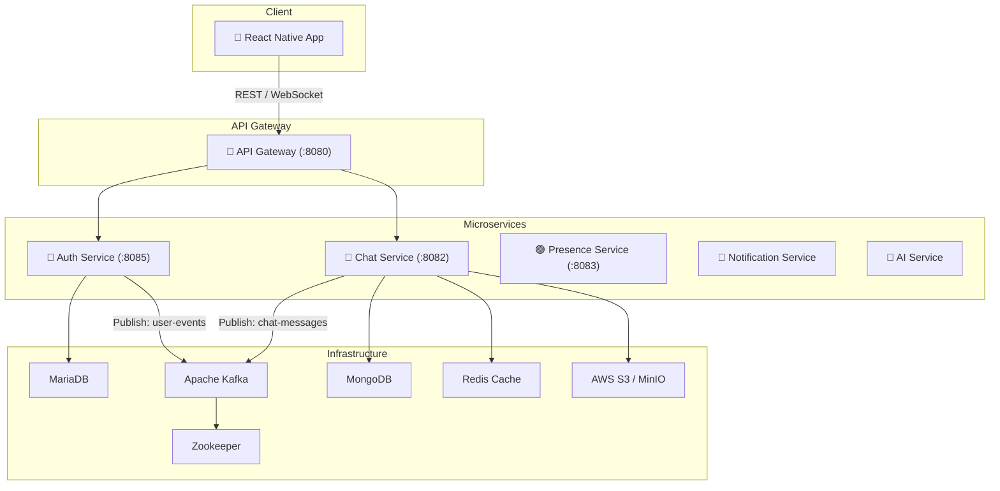

<div align="center">
  
  <h1>🎓 IUH Connect</h1>
  <p><b>Hệ thống giao tiếp nội bộ thông minh dành cho sinh viên và giảng viên trường Đại học Công nghiệp TP.HCM (IUH)</b></p>

  [](https://reactnative.dev/)
  [](https://spring.io/projects/spring-boot)
  [](https://kafka.apache.org/)
  [](https://www.mongodb.com/)
  [](https://redis.io/)
  [](https://aws.amazon.com/s3/)
  [](https://www.docker.com/)
</div>

<br />

> **IUH Connect** là nền tảng nhắn tin và liên lạc nội bộ xây dựng trên kiến trúc **Microservices**, ứng dụng các công nghệ tiên tiến nhất để đảm bảo khả năng mở rộng, tính ổn định và trải nghiệm người dùng mượt mà theo chuẩn các ứng dụng OTT chuyên nghiệp.

## 🌟 Tính Năng Nổi Bật

### 💬 Chat Real-time & Media
- Giao tiếp thời gian thực mượt mà qua **WebSocket** và **Apache Kafka**.
- Giao diện chat hiện đại, hỗ trợ **Tin nhắn thoại (Waveform)**, **Video Preview**, và **File Document**.
- Upload file cực nhanh trực tiếp lên **AWS S3** thông qua cơ chế *Presigned URL*.

### 👨‍🏫 Chế Độ Tư Vấn (Dành cho Giảng Viên)
- Hệ thống **Presence Tracking** siêu tốc bằng **Redis** để theo dõi trạng thái Online/Offline.
- Tính năng báo **Bận (Busy)** và **Tin nhắn trả lời tự động** giúp giảng viên dễ dàng quản lý khung giờ tư vấn.

### 🔔 Thông Báo Push Notification
- Hệ thống thông báo đẩy tích hợp **Firebase Cloud Messaging (FCM)** đảm bảo không bỏ lỡ tin nhắn.

## 🏗 Kiến Trúc Hệ Thống (Microservices)

Dự án được chia làm 2 khối chính: **Frontend (React Native)** và **Backend (Spring Boot Microservices)**.



### 🧩 Chi tiết các Service

| Service | Vai trò | Công nghệ |
|---------|---------|-----------|
| **API Gateway** | Cửa ngõ định tuyến, Rate Limiting, JWT Verification | Spring Cloud Gateway |
| **Auth Service** | Quản lý User, Login/Register, Friends | Spring Boot, MariaDB |
| **Chat Service** | Xử lý WS, lưu trữ tin nhắn, S3 Upload | Spring Boot, Mongo, Redis, Kafka |
| **Presence Service**| Tracking trạng thái Online/Offline/Busy | Redis Pub/Sub |
| **Notification** | Bắn thông báo Push qua FCM | Firebase Admin SDK |

## 🚀 Hướng Dẫn Cài Đặt (Local Development)

### 1. Khởi động Hạ tầng Backend (Docker)
Yêu cầu: Đã cài đặt Docker và Docker Compose.

```bash
# Tại thư mục gốc của project
docker-compose up --build -d
```
Lệnh này sẽ khởi tạo: `Zookeeper`, `Kafka`, `MariaDB`, `MongoDB`, `Redis`, `MinIO` và toàn bộ các Microservices.

### 2. Khởi chạy Frontend (React Native)
Yêu cầu: Đã cấu hình môi trường React Native (Node.js, Android Studio/SDK).

```bash
cd frontend
npm install

# Đổi SERVER_IP trong frontend/src/config/env.ts thành IP LAN của máy bạn
# Ví dụ: export const API_URL = 'http://192.168.1.5:8080';

# Chạy Metro Bundler
npx react-native start

# Build lên máy ảo/thiết bị Android
npx react-native run-android
```

## 🔒 Thông Tin Đăng Nhập Mặc Định (Local Infra)

- **MariaDB**: `root` / `root123` (Database: `auth_db`)
- **MongoDB**: `iuh_admin` / `iuh_mongo_pass`
- **Redis**: `iuh_redis_pass`
- **MinIO**: `iuh_minio_admin` / `iuh_minio_password`

## 🔮 Roadmap Phát Triển (Sắp Tới)

- [ ] **Meeting Module**: Tích hợp Jitsi Meet hoàn chỉnh với tính năng hand-off (chuyển thiết bị từ Mobile sang Desktop).
- [ ] **AI Support**: Tích hợp AI Service giúp tóm tắt nội dung học tập và hỗ trợ trả lời tự động thông minh.
- [ ] **Web App**: Phát triển phiên bản Web/Desktop sử dụng ReactJS.

---
<div align="center">
  <i>Đồ án Kiến Trúc Phần Mềm - Đại Học Công Nghiệp TP.HCM</i>
</div>
