# IUH Connect

> Nền tảng chat cho IUH theo kiến trúc microservices, gồm frontend React Native và backend Spring Boot.

## 1. Giới thiệu

`IUH Connect` là project xây dựng ứng dụng nhắn tin thời gian thực cho môi trường đại học. Repository hiện gồm:

- `frontend`: ứng dụng di động React Native.
- `backend/api-gateway`: cổng vào duy nhất cho REST và WebSocket.
- `backend/auth-service`: xác thực, JWT, hồ sơ người dùng, danh bạ và kết bạn.
- `backend/chat-service`: chat thời gian thực qua WebSocket, Kafka, MongoDB và upload media qua MinIO.
- `backend/presence-service`: service đã được tạo khung nhưng chưa có nghiệp vụ thực tế.
- `backend/notification-service`: service worker đã được tạo khung nhưng chưa có nghiệp vụ thực tế.

Về mặt triển khai, hệ thống dùng Docker Compose để chạy toàn bộ hạ tầng và backend service.

## 2. Trạng thái thực tế của project

Phần đã hoạt động theo code hiện tại:

- đăng ký và đăng nhập bằng JWT
- lấy và cập nhật hồ sơ cá nhân
- gửi lời mời kết bạn, chấp nhận kết bạn, xem danh sách bạn bè
- kết nối WebSocket chat qua API Gateway
- gửi tin nhắn theo pipeline `WebSocket -> Kafka -> Chat Consumer -> MongoDB`
- lấy lịch sử tin nhắn và danh sách hội thoại gần đây
- sinh presigned URL để upload file trực tiếp lên MinIO

Phần mới có cấu trúc nhưng chưa hoàn thiện:

- `presence-service`
- `notification-service`
- một số màn frontend vẫn dùng dữ liệu mock hoặc UI demo

## 3. Kiến trúc triển khai thực tế

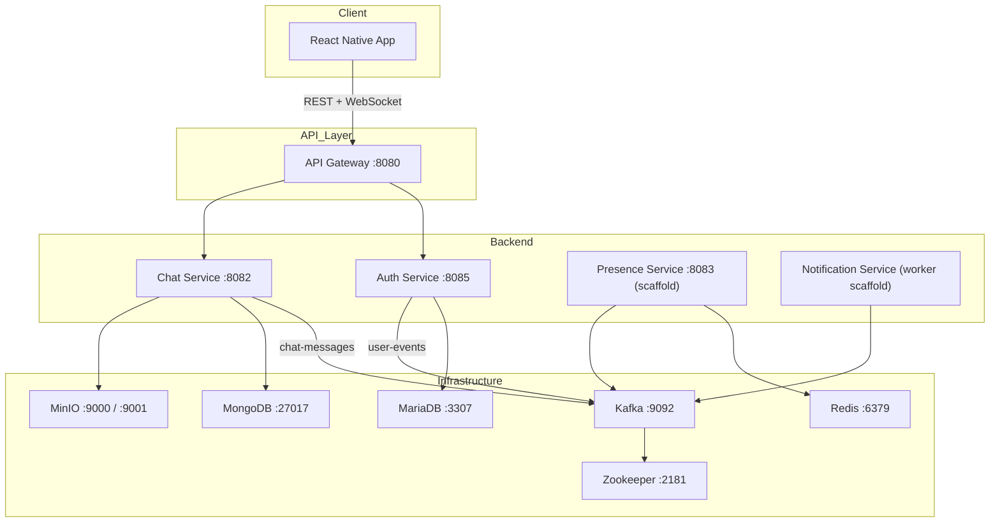

## 4. Sơ đồ component-level

### 4.1. Auth service

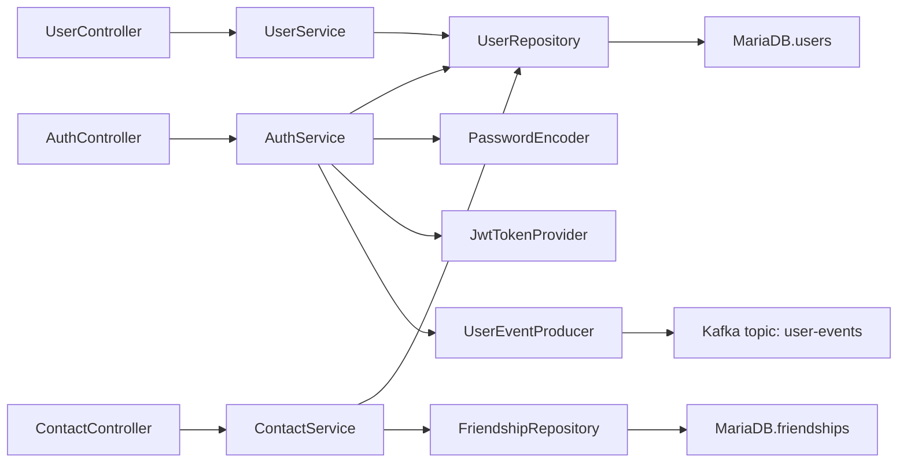

### 4.2. Chat service

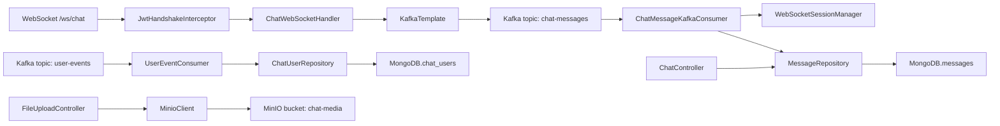

### 4.3. Frontend

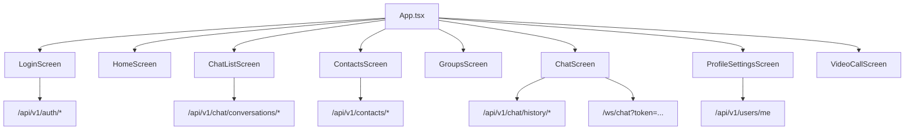

## 5. Ghi chú quan trọng về implementation

- `auth-service` chạy ở cổng `8085`, không phải `8081`.
- `chat-service` hiện chưa dùng Redis Pub/Sub trong code, dù Redis có mặt trong `docker-compose.yml`.
- Broadcast tin nhắn hiện đang dựa vào Kafka consumer với `groupId` sinh động trong `ChatMessageKafkaConsumer`.
- Với cách làm hiện tại, nếu scale nhiều instance `chat-service`, khả năng fan-out có thể hoạt động nhưng việc lưu MongoDB có nguy cơ bị trùng bản ghi nếu không bổ sung cơ chế deduplicate.
- `presence-service` và `notification-service` mới chỉ có lớp khởi động Spring Boot, chưa có controller, consumer, handler hoặc service nghiệp vụ.

## 6. Danh sách service

| Service | Port | Trạng thái | Vai trò chính |
| --- | --- | --- | --- |
| `api-gateway` | `8080` | Hoạt động | Route REST và WebSocket vào backend |
| `auth-service` | `8085` | Hoạt động | Đăng ký, đăng nhập, JWT, profile, contacts |
| `chat-service` | `8082` | Hoạt động | WebSocket chat, Kafka pipeline, MongoDB, MinIO |
| `presence-service` | `8083` | Scaffold | Chưa có nghiệp vụ thực tế |
| `notification-service` | không expose port | Scaffold | Chưa có nghiệp vụ thực tế |
| `frontend` | app mobile | Hoạt động/demo | Giao diện client cho login, chat, contacts, profile |

## 7. Luồng xử lý chính

### 7.1. Luồng đăng ký người dùng

1. Client gọi `POST /api/v1/auth/register` qua gateway hoặc trực tiếp tới `auth-service`.
2. `AuthController` chuyển request vào `AuthService`.
3. `AuthService` kiểm tra username, mã hóa password, lưu user vào MariaDB.
4. Sau khi lưu thành công, `AuthService` publish event lên Kafka topic `user-events`.
5. `UserEventConsumer` của `chat-service` consume event này và upsert `ChatUser` vào MongoDB.
6. `auth-service` trả về access token và refresh token.

### 7.2. Luồng đăng nhập

1. Client gọi `POST /api/v1/auth/login`.
2. `AuthService` kiểm tra username và password.
3. Nếu hợp lệ, hệ thống sinh JWT và trả token cho client.

### 7.3. Luồng chat thời gian thực

1. Client mở WebSocket tới `ws://<host>:8080/ws/chat?token=<jwt>`.
2. API Gateway forward kết nối sang `chat-service`.
3. `JwtHandshakeInterceptor` xác thực token và lấy username từ JWT.
4. `ChatWebSocketHandler` nhận tin nhắn JSON từ client.
5. Handler đẩy message vào Kafka topic `chat-messages`.
6. `ChatMessageKafkaConsumer` consume message.
7. Consumer cố gắng gửi message tới session WebSocket đang online trên node hiện tại.
8. Consumer lưu message vào MongoDB.

## 8. Sơ đồ sequence chi tiết theo use case

### 8.1. Use case đăng ký tài khoản

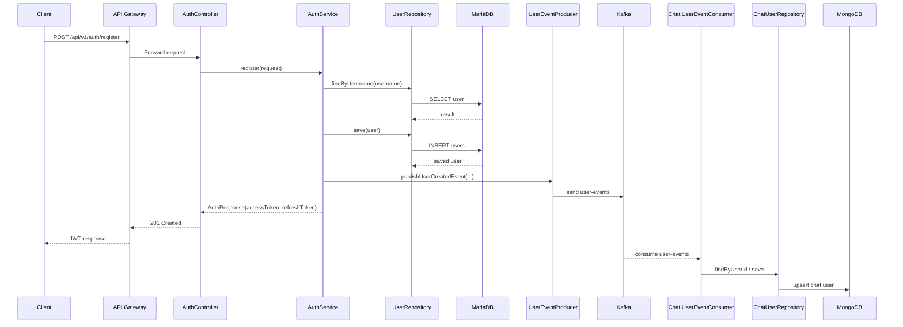

### 8.2. Use case đăng nhập

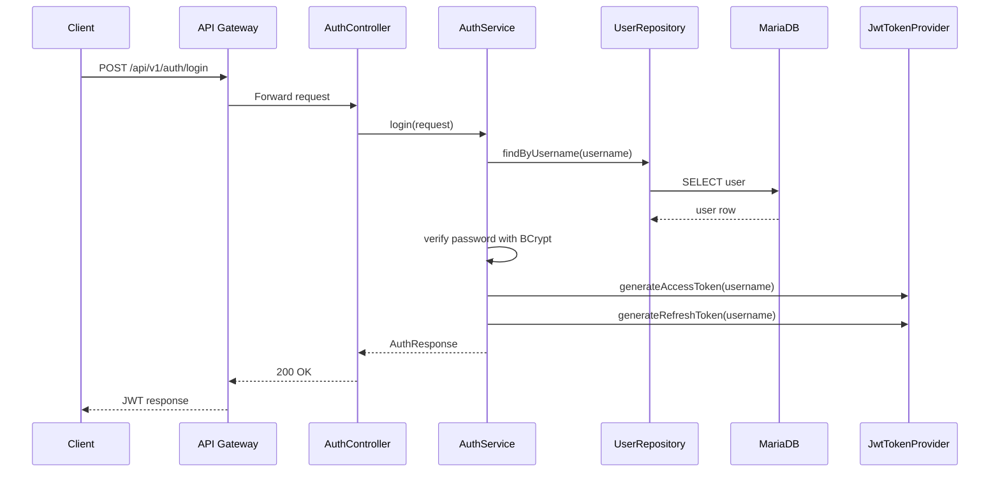

### 8.3. Use case lấy hồ sơ cá nhân

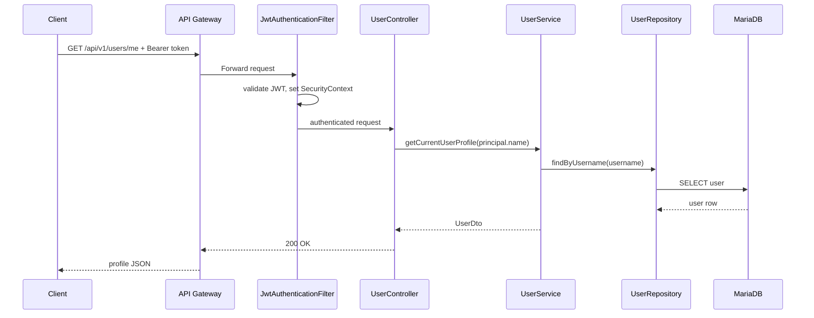

### 8.4. Use case gửi lời mời kết bạn

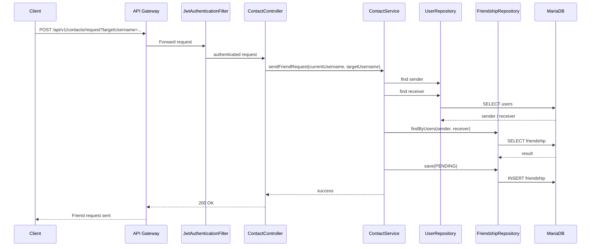

### 8.5. Use case chấp nhận kết bạn

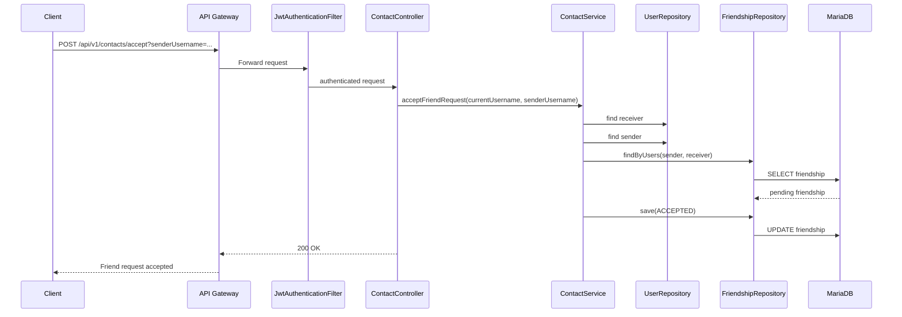

### 8.6. Use case kết nối WebSocket chat

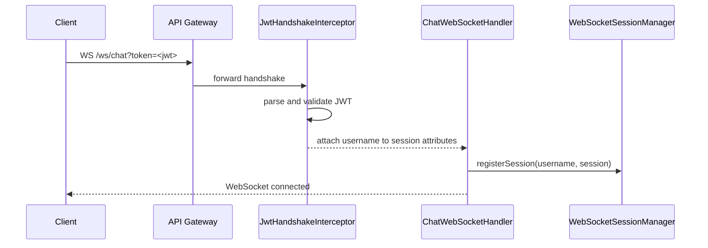

### 8.7. Use case gửi tin nhắn realtime

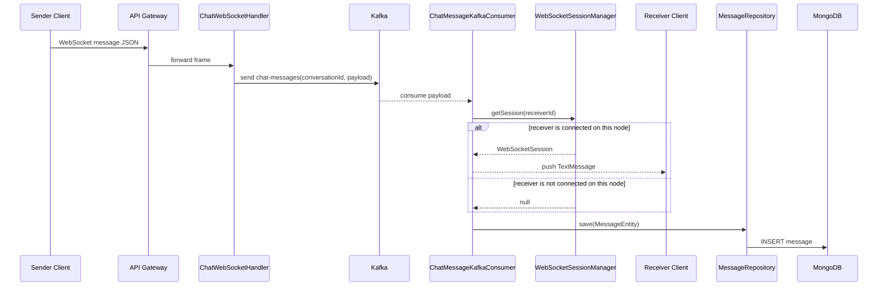

### 8.8. Use case lấy lịch sử hội thoại

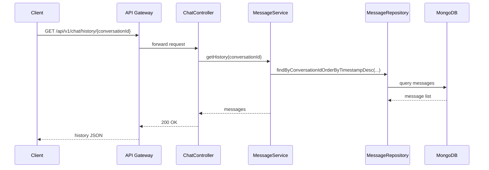

### 8.9. Use case lấy URL upload file

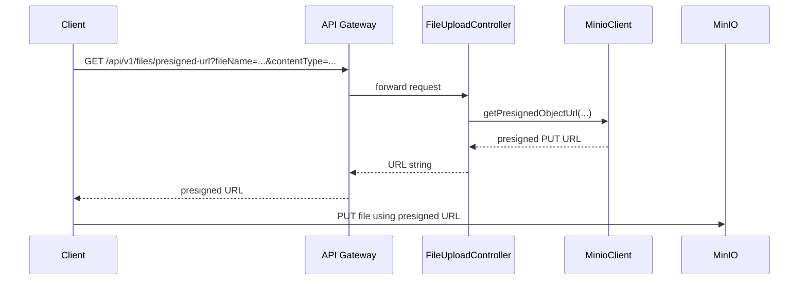

## 9. Bảng mapping giữa source code và kiến trúc

### 9.1. Mapping tổng quan backend

| Thành phần kiến trúc | Vai trò | Source code chính |
| --- | --- | --- |
| API Gateway | Route REST và WebSocket | `backend/api-gateway/src/main/java/com/iuhconnect/gateway/ApiGatewayApplication.java`, `backend/api-gateway/src/main/resources/application.yml` |
| Auth API layer | Nhận request auth | `backend/auth-service/src/main/java/com/iuhconnect/authservice/controller/AuthController.java` |
| User API layer | Hồ sơ người dùng | `backend/auth-service/src/main/java/com/iuhconnect/authservice/controller/UserController.java` |
| Contact API layer | Kết bạn và danh bạ | `backend/auth-service/src/main/java/com/iuhconnect/authservice/controller/ContactController.java` |
| Auth business logic | Đăng ký, đăng nhập, sinh token | `backend/auth-service/src/main/java/com/iuhconnect/authservice/service/AuthService.java` |
| User business logic | Đọc và cập nhật profile | `backend/auth-service/src/main/java/com/iuhconnect/authservice/service/UserService.java` |
| Contact business logic | Gửi/chấp nhận lời mời kết bạn | `backend/auth-service/src/main/java/com/iuhconnect/authservice/service/ContactService.java` |
| JWT security | Lọc request và xử lý token | `backend/auth-service/src/main/java/com/iuhconnect/authservice/security/JwtAuthenticationFilter.java`, `backend/auth-service/src/main/java/com/iuhconnect/authservice/security/JwtTokenProvider.java`, `backend/auth-service/src/main/java/com/iuhconnect/authservice/config/SecurityConfig.java` |
| Auth persistence | Truy cập MariaDB | `backend/auth-service/src/main/java/com/iuhconnect/authservice/repository/UserRepository.java`, `backend/auth-service/src/main/java/com/iuhconnect/authservice/repository/FriendshipRepository.java` |
| User event producer | Publish `user-events` | `backend/auth-service/src/main/java/com/iuhconnect/authservice/service/UserEventProducer.java`, `backend/auth-service/src/main/java/com/iuhconnect/authservice/config/KafkaProducerConfig.java` |
| Chat REST API | Lịch sử chat, hội thoại gần đây | `backend/chat-service/src/main/java/com/iuhconnect/chatservice/controller/ChatController.java` |
| File API | Sinh presigned URL upload | `backend/chat-service/src/main/java/com/iuhconnect/chatservice/controller/FileUploadController.java` |
| WebSocket auth | Xác thực JWT khi handshake | `backend/chat-service/src/main/java/com/iuhconnect/chatservice/security/JwtHandshakeInterceptor.java` |
| WebSocket handler | Nhận frame chat từ client | `backend/chat-service/src/main/java/com/iuhconnect/chatservice/handler/ChatWebSocketHandler.java` |
| Session manager | Quản lý session WebSocket theo user | `backend/chat-service/src/main/java/com/iuhconnect/chatservice/handler/WebSocketSessionManager.java` |
| Chat consumer | Consume `chat-messages`, gửi WS, lưu DB | `backend/chat-service/src/main/java/com/iuhconnect/chatservice/consumer/ChatMessageKafkaConsumer.java` |
| User sync consumer | Consume `user-events`, sync `ChatUser` | `backend/chat-service/src/main/java/com/iuhconnect/chatservice/consumer/UserEventConsumer.java` |
| Chat service layer | Truy vấn lịch sử message | `backend/chat-service/src/main/java/com/iuhconnect/chatservice/service/MessageService.java` |
| Chat persistence | Truy cập MongoDB | `backend/chat-service/src/main/java/com/iuhconnect/chatservice/repository/MessageRepository.java`, `backend/chat-service/src/main/java/com/iuhconnect/chatservice/repository/ChatUserRepository.java` |
| Kafka config | Producer/consumer config cho chat | `backend/chat-service/src/main/java/com/iuhconnect/chatservice/config/KafkaProducerConfig.java`, `backend/chat-service/src/main/java/com/iuhconnect/chatservice/config/KafkaConsumerConfig.java` |
| MinIO config | Kết nối object storage | `backend/chat-service/src/main/java/com/iuhconnect/chatservice/config/MinioConfig.java` |
| Presence scaffold | Service hiện mới bootstrap | `backend/presence-service/src/main/java/com/iuhconnect/presenceservice/PresenceServiceApplication.java` |
| Notification scaffold | Service hiện mới bootstrap | `backend/notification-service/src/main/java/com/iuhconnect/notificationservice/NotificationServiceApplication.java` |

### 9.2. Mapping frontend với use case

| Use case / màn hình | Source code chính | Ghi chú |
| --- | --- | --- |
| Điều phối navigation và app shell | `frontend/App.tsx` | Khai báo stack, tab, splash screen |
| Đăng ký / đăng nhập | `frontend/src/screens/LoginScreen.tsx` | Gọi `/api/v1/auth/login` và `/api/v1/auth/register` |
| Danh sách hội thoại | `frontend/src/screens/ChatListScreen.tsx` | Gọi `/api/v1/chat/conversations/{userId}` |
| Màn hình chat | `frontend/src/screens/ChatScreen.tsx` | Gọi history REST và WebSocket `/ws/chat` |
| Danh bạ / kết bạn | `frontend/src/screens/ContactsScreen.tsx` | Gọi nhóm API `/api/v1/contacts/*` |
| Hồ sơ cá nhân | `frontend/src/screens/ProfileSettingsScreen.tsx` | Gọi `/api/v1/users/me` |
| Trang chủ | `frontend/src/screens/HomeScreen.tsx` | Chủ yếu dữ liệu mock/demo |
| Nhóm | `frontend/src/screens/GroupsScreen.tsx` | Chủ yếu dữ liệu mock/demo |
| Video call | `frontend/src/screens/VideoCallScreen.tsx` | Demo UI, chưa có backend call |
| Component giao diện hỗ trợ | `frontend/src/components/*` | Avatar, trạng thái, banner offline, typing indicator |

## 10. API hiện đang có

### 10.1. Auth và user

Các route bên dưới đang đi qua `api-gateway`:

- `POST /api/v1/auth/register`
- `POST /api/v1/auth/login`
- `GET /api/v1/users/me`
- `PUT /api/v1/users/me`
- `POST /api/v1/contacts/request?targetUsername=<username>`
- `POST /api/v1/contacts/accept?senderUsername=<username>`
- `GET /api/v1/contacts/pending`
- `GET /api/v1/contacts/list`

### 10.2. Chat

- `GET /api/v1/chat/history/{conversationId}`
- `GET /api/v1/chat/conversations/{userId}`
- `GET /api/v1/files/presigned-url?fileName=<name>&contentType=<type>`
- `WS /ws/chat?token=<jwt>`

### 10.3. Format tin nhắn WebSocket

```json
{
  "senderId": "user1",
  "receiverId": "user2",
  "content": "Hello",
  "conversationId": "user1-user2",
  "timestamp": 1711234567890
}
```

## 11. Công nghệ sử dụng

| Tầng | Công nghệ |
| --- | --- |
| Frontend | React Native 0.73, React Navigation, Gifted Chat |
| API Gateway | Spring Cloud Gateway |
| Backend | Spring Boot 3.2, Java 17 |
| Security | Spring Security, JWT (`jjwt`) |
| Messaging | Apache Kafka, Zookeeper |
| CSDL quan hệ | MariaDB 11 |
| CSDL document | MongoDB 7 |
| Cache / hạ tầng dự kiến | Redis 7.2 |
| Object storage | MinIO |
| Build tool | Maven, npm |
| Container | Docker Compose |

## 12. Cách chạy hệ thống

### 12.1. Yêu cầu trước khi chạy

- Docker
- Docker Compose
- Node.js `>= 18` nếu muốn chạy frontend
- Môi trường React Native Android/iOS nếu muốn build app mobile

### 12.2. Chạy toàn bộ backend và hạ tầng

```bash
docker-compose up --build -d
```

### 12.3. Các container dự kiến

Sau khi khởi động thành công, Compose sẽ chạy các container:

- `iuh-zookeeper`
- `iuh-kafka`
- `iuh-mariadb`
- `iuh-mongodb`
- `iuh-redis`
- `iuh-minio`
- `iuh-auth-service`
- `iuh-chat-service`
- `iuh-api-gateway`
- `iuh-presence-service`
- `iuh-notification-service`

Kiểm tra bằng lệnh:

```bash
docker ps -a --filter "name=iuh" --format "table {{.Names}}\t{{.Status}}\t{{.Ports}}"
```

### 12.4. Test nhanh

Đăng ký qua gateway:

```bash
curl -X POST http://localhost:8080/api/v1/auth/register \
  -H "Content-Type: application/json" \
  -d "{\"username\":\"testuser\",\"password\":\"123456\",\"fullName\":\"Test User\",\"email\":\"test@example.com\"}"
```

Đăng nhập qua gateway:

```bash
curl -X POST http://localhost:8080/api/v1/auth/login \
  -H "Content-Type: application/json" \
  -d "{\"username\":\"testuser\",\"password\":\"123456\"}"
```

Health check gateway:

```bash
curl http://localhost:8080/actuator/health
```

### 12.5. Dừng hệ thống

```bash
docker-compose down
```

Xóa cả volume để reset dữ liệu:

```bash
docker-compose down -v
```

## 13. Cách chạy frontend

```bash
cd frontend
npm install
npx react-native start
```

Mở terminal khác:

```bash
npx react-native run-android
```

Ghi chú:

- Trên Android emulator, app đang gọi `http://10.0.2.2:8080`.
- Trên nền tảng khác, app đang gọi `http://localhost:8080`.
- Một số màn như `HomeScreen`, `GroupsScreen`, `VideoCallScreen` hiện mang tính demo UI nhiều hơn là tích hợp backend đầy đủ.

## 14. Cấu trúc thư mục

```text
BaiTapLon/
├── docker-compose.yml
├── README.md
├── backend/
│   ├── api-gateway/
│   ├── auth-service/
│   ├── chat-service/
│   ├── notification-service/
│   └── presence-service/
└── frontend/
```

## 15. Thông tin cấu hình local development

| Thành phần | Giá trị |
| --- | --- |
| MariaDB root password | `root123` |
| MariaDB database | `auth_db` |
| MariaDB user / password | `iuh_user` / `iuh_pass` |
| MongoDB database | `iuh_connect_db` |
| MongoDB admin user / password | `iuh_admin` / `iuh_mongo_pass` |
| Redis password | `iuh_redis_pass` |
| MinIO root user / password | `iuh_minio_admin` / `iuh_minio_password` |
| JWT secret | `IUHConnectSuperSecretKeyForJWT2024MustBeAtLeast256BitsLong!!` |

Các giá trị trên chỉ nên dùng cho môi trường phát triển nội bộ.

## 16. Phân tích ưu/nhược điểm kiến trúc microservices

### 16.1. Ưu điểm

- Phân tách trách nhiệm rõ ràng: `auth-service` xử lý người dùng và bảo mật, `chat-service` xử lý realtime chat, `api-gateway` làm điểm vào thống nhất. Điều này giúp code dễ tổ chức và dễ mở rộng hơn monolith.
- Dễ mở rộng theo tải thực tế: nếu lưu lượng chat tăng mạnh, về mặt kiến trúc có thể scale `chat-service` độc lập với `auth-service`.
- Phù hợp với nghiệp vụ bất đồng bộ: Kafka rất hợp cho các luồng như đồng bộ user sang read model và xử lý message không chặn request đồng bộ.
- Công nghệ lưu trữ được chọn theo mục đích: MariaDB phù hợp dữ liệu giao dịch như user/friendship; MongoDB phù hợp message document và truy vấn hội thoại.
- Tăng tính độc lập triển khai: mỗi service có thể build, cấu hình và triển khai riêng.
- Tạo nền tảng để mở rộng nghiệp vụ sau này: `presence-service`, `notification-service`, MinIO cho media đều cho thấy kiến trúc đã chuẩn bị sẵn cho các tính năng tiếp theo.

### 16.2. Nhược điểm

- Độ phức tạp hệ thống tăng lên rõ rệt: chỉ để chạy local đã cần nhiều thành phần như Gateway, Kafka, Zookeeper, MariaDB, MongoDB, Redis, MinIO và nhiều service.
- Debug khó hơn monolith: một use case đơn giản như gửi tin nhắn phải đi qua WebSocket, Gateway, Kafka, Consumer và MongoDB.
- Chi phí đồng bộ dữ liệu cao hơn: user được lưu ở MariaDB nhưng lại cần sync sang MongoDB qua event, dẫn tới khả năng chậm đồng bộ hoặc lệch dữ liệu tạm thời.
- Yêu cầu thiết kế event cẩn thận: nếu message processing không có idempotency tốt thì khi scale out sẽ dễ bị duplicate hoặc inconsistency.
- Testing tích hợp phức tạp: phải kiểm tra cả REST, WebSocket, Kafka và nhiều kho dữ liệu cùng lúc.
- Vận hành khó hơn: cần giám sát nhiều service, nhiều port, nhiều cấu hình môi trường hơn so với kiến trúc đơn khối.

### 16.3. Đánh giá cụ thể trên project này

- Project đã thể hiện đúng tinh thần microservices ở mức tách domain và dùng event-driven.
- Tuy nhiên implementation hiện tại vẫn đang ở giai đoạn phát triển học thuật, chưa đạt mức production-ready.
- Điểm yếu lớn nhất là `chat-service` chưa hoàn chỉnh cơ chế broadcast đa node và chống duplicate khi scale nhiều instance.
- Hai service `presence-service` và `notification-service` mới dừng ở scaffold, nên lợi ích “mở rộng độc lập” mới dừng ở mức định hướng kiến trúc.
- Dù vậy, đối với đồ án, cấu trúc hiện tại là một nền tảng tốt để trình bày các khái niệm microservices, API Gateway, event-driven architecture, CQRS/read-model sync và polyglot persistence.

## 17. Hạn chế hiện tại và hướng cải thiện

Các điểm chưa hoàn thiện trong code hiện tại:

- `chat-service` chưa có cơ chế chống ghi trùng message khi scale nhiều instance.
- Redis đã được deploy nhưng chưa được dùng đúng vai trò broadcast realtime trong `chat-service`.
- `UserServiceClient` trong `chat-service` đã được khai báo nhưng chưa thể hiện luồng sử dụng rõ ràng trong nghiệp vụ hiện tại.
- `presence-service` và `notification-service` mới là skeleton.
- frontend còn nhiều màn mock dữ liệu, chưa nối trọn backend.

Hướng cải thiện hợp lý:

1. Tách riêng consumer lưu DB và consumer broadcast.
2. Đưa Redis Pub/Sub vào đúng vai trò broadcast đa node.
3. Bổ sung presence thật sự và push notification thật sự.
4. Chuẩn hóa conversation id và message id để tránh duplicate.
5. Hoàn thiện frontend theo API thực tế thay vì dùng mock ở nhiều màn.
