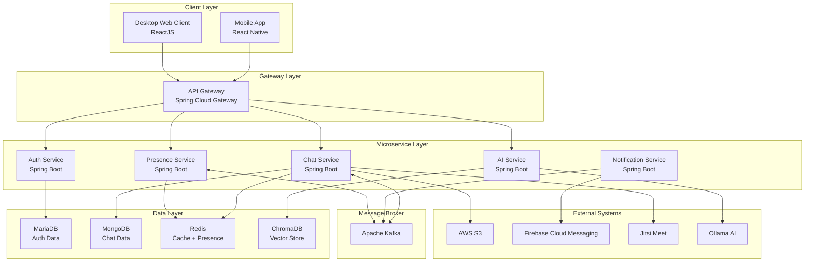
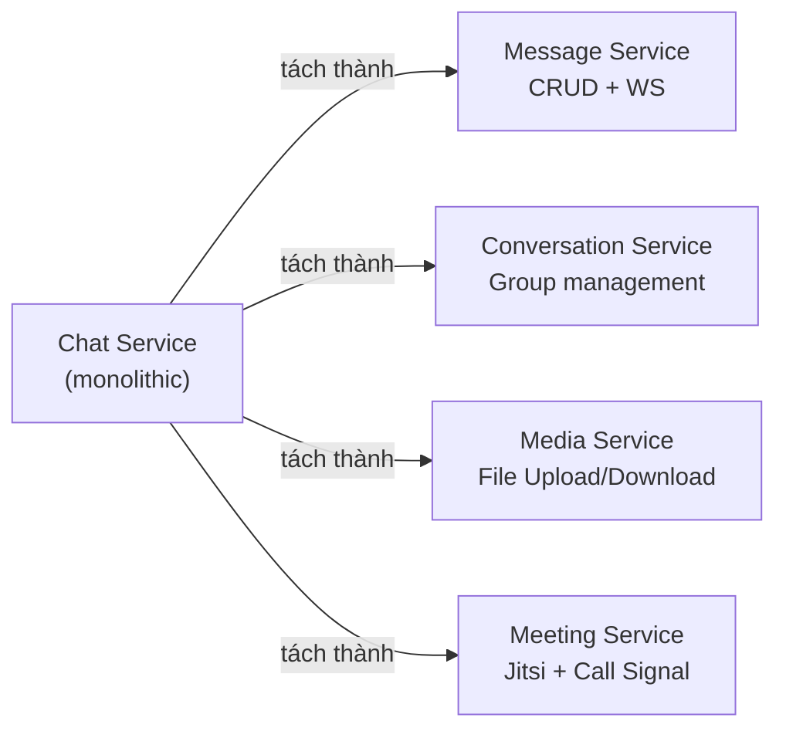
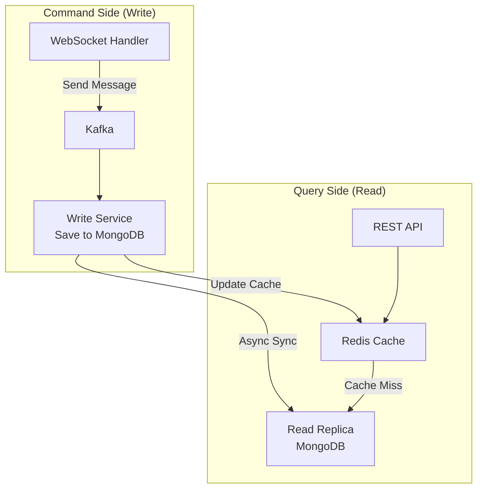
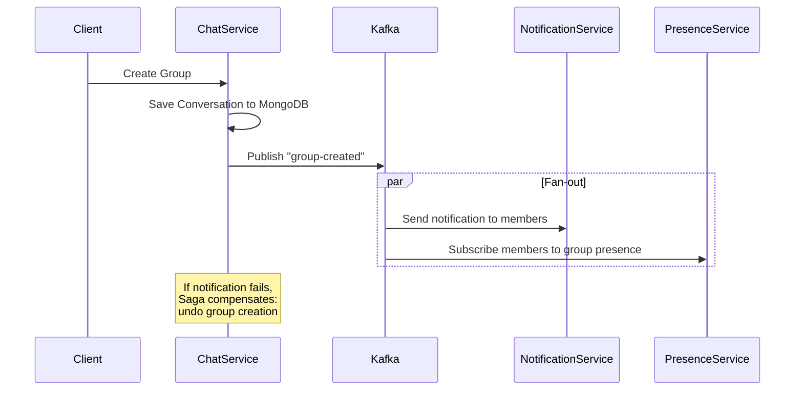
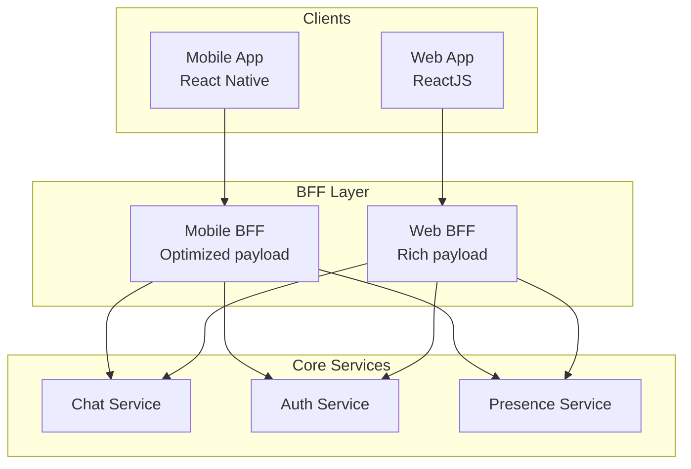
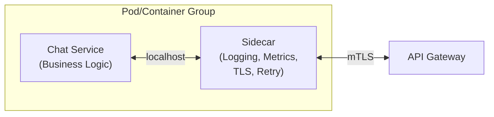
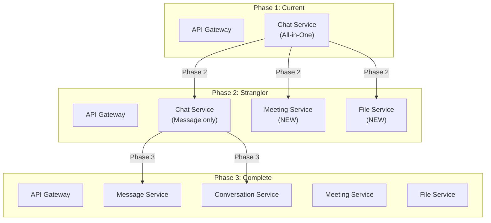
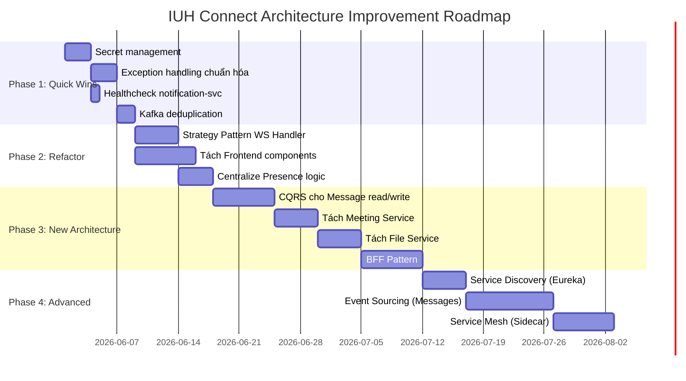

# 🏗️ Phân Tích Kiến Trúc Dự Án IUH Connect

## 1. Tổng Quan Kiến Trúc Hiện Tại



### Các Design Pattern Đã Sử Dụng

| Pattern | Nơi áp dụng | Mô tả |
|---------|-------------|--------|
| **API Gateway** | `api-gateway` | Single entry point, JWT validation, rate limiting, circuit breaker |
| **Event-Driven Architecture** | Kafka topics | `chat-messages`, `presence-events`, `user-events`, `contact-events` |
| **Database-per-Service** | MariaDB / MongoDB / Redis | Mỗi service có datastore riêng |
| **Circuit Breaker** | Resilience4j @ Gateway | Ngăn cascade failure giữa các service |
| **Rate Limiting** | Redis-backed @ Gateway | Chống DDoS và lạm dụng API |
| **Pub/Sub (Redis)** | Cross-instance signaling | Giao tiếp WebSocket giữa các instance |
| **Observer Pattern** | WebSocket listeners | Frontend listener system cho realtime events |
| **Offline Queue** | Frontend `offlineQueue.ts` | Retry message khi mất kết nối |

---

## 2. Điểm Yếu Của Kiến Trúc Hiện Tại

### 🔴 Mức Nghiêm Trọng Cao (Critical)

---

#### 2.1. Chat Service Quá Tải Trách Nhiệm (God Service Anti-Pattern)

> [!CAUTION]
> Chat Service đang gánh quá nhiều trách nhiệm, vi phạm nguyên tắc **Single Responsibility** trong Microservices.

**Bằng chứng trong code:**

Chat Service hiện đang xử lý **8+ tính năng riêng biệt** trong cùng 1 service:

| Tính năng | File | Trách nhiệm |
|-----------|------|-------------|
| Tin nhắn | [MessageService.java](file:///d:/KienTrucDuAn/IUH_CONNECT/backend/chat-service/src/main/java/com/iuhconnect/chatservice/service/MessageService.java) | CRUD tin nhắn, aggregation |
| Conversation | [ConversationService.java](file:///d:/KienTrucDuAn/IUH_CONNECT/backend/chat-service/src/main/java/com/iuhconnect/chatservice/service/ConversationService.java) | Quản lý nhóm, thêm/xoá thành viên |
| WebSocket | [ChatWebSocketHandler.java](file:///d:/KienTrucDuAn/IUH_CONNECT/backend/chat-service/src/main/java/com/iuhconnect/chatservice/handler/ChatWebSocketHandler.java) | Xử lý WS connection, routing |
| Presence | [PresenceService.java](file:///d:/KienTrucDuAn/IUH_CONNECT/backend/chat-service/src/main/java/com/iuhconnect/chatservice/service/PresenceService.java) | Quản lý online/offline |
| Video Call | [CallSignalService.java](file:///d:/KienTrucDuAn/IUH_CONNECT/backend/chat-service/src/main/java/com/iuhconnect/chatservice/service/CallSignalService.java) | Call signaling |
| Meeting | [MeetingSessionService.java](file:///d:/KienTrucDuAn/IUH_CONNECT/backend/chat-service/src/main/java/com/iuhconnect/chatservice/service/MeetingSessionService.java) | Jitsi meeting management |
| File Upload | [FileUploadController.java](file:///d:/KienTrucDuAn/IUH_CONNECT/backend/chat-service/src/main/java/com/iuhconnect/chatservice/controller/FileUploadController.java) | S3 upload/download |
| Auto Reply | [AutoReplyService.java](file:///d:/KienTrucDuAn/IUH_CONNECT/backend/chat-service/src/main/java/com/iuhconnect/chatservice/service/AutoReplyService.java) | Phản hồi tự động |
| User Settings | [UserConversationSettingsService.java](file:///d:/KienTrucDuAn/IUH_CONNECT/backend/chat-service/src/main/java/com/iuhconnect/chatservice/service/UserConversationSettingsService.java) | Pin/mute/archive |

**Hậu quả:**
- Khi cần scale Chat Message → phải scale cả Meeting, File Upload (lãng phí tài nguyên)
- Một bug trong FileUpload có thể crash toàn bộ Chat Service
- Deploy một thay đổi nhỏ cần redeploy cả service lớn

---

#### 2.2. Trùng Lặp Logic Presence (Code Duplication)

> [!WARNING]
> Có **2 class PresenceService** riêng biệt, ghi vào **cùng Redis keys**, tạo ra race condition tiềm ẩn.

````carousel
```java
// chat-service/service/PresenceService.java - Line 21-28
private static final String INSTANCE_KEY_PREFIX = "presence:user:";
private static final String PRESENCE_KEY_PREFIX = "presence:";
private static final String LAST_SEEN_KEY_PREFIX = "lastseen:";
```
<!-- slide -->
```java
// presence-service/service/PresenceService.java - Line 20-23
private static final String PRESENCE_KEY_PREFIX = "presence:";
private static final String LAST_SEEN_KEY_PREFIX = "lastseen:";
private static final String WORK_STATUS_KEY_PREFIX = "workstatus:";
```
````

**Vấn đề:** Cả 2 service đều ghi vào `presence:{userId}` và `lastseen:{userId}` → có thể ghi đè lẫn nhau, gây nhầm trạng thái online/offline.

---

#### 2.3. WebSocket Handler Monolithic (Phức Tạp Quá Mức)

> [!WARNING]
> `ChatWebSocketHandler.java` xử lý **tất cả loại message** trong cùng một `handleTextMessage()` — vi phạm Open/Closed Principle.

Trong [ChatWebSocketHandler.java](file:///d:/KienTrucDuAn/IUH_CONNECT/backend/chat-service/src/main/java/com/iuhconnect/chatservice/handler/ChatWebSocketHandler.java#L58-L144), method `handleTextMessage()` chứa logic cho:
- `PING` → Heartbeat
- `CALL_SIGNAL` → Video call signaling
- `WEBRTC` → Legacy WebRTC (đang deprecated nhưng vẫn tồn tại)
- `READ_RECEIPT` → Đánh dấu đã đọc
- **Default** → Chat message to Kafka

Mỗi khi thêm loại message mới, phải sửa file này → rất khó bảo trì.

---

#### 2.4. Hardcoded JWT Secret

> [!CAUTION]
> JWT Secret đang được hardcode trực tiếp trong code và docker-compose.

```yaml
# docker-compose.yml - Line 233
JWT_SECRET: IUHConnectSuperSecretKeyForJWT2024MustBeAtLeast256BitsLong!!
```

```yaml
# application.yml - Line 150
jwt:
  secret: ${JWT_SECRET:IUHConnectSuperSecretKeyForJWT2024MustBeAtLeast256BitsLong!!}
```

**Rủi ro bảo mật:** Secret bị lộ trong Git repository. Bất kỳ ai có access vào repo đều có thể forge JWT token.

---

### 🟡 Mức Trung Bình (Medium)

---

#### 2.5. Frontend Component Quá Lớn (Monolithic Screens)

> [!IMPORTANT]
> Một số file screen quá lớn, khó maintain và test.

| File | Size | Lines (ước tính) |
|------|------|----------|
| [ChatScreen.tsx](file:///d:/KienTrucDuAn/IUH_CONNECT/frontend/src/screens/ChatScreen.tsx) | **97 KB** | ~2500+ lines |
| [GroupSettingsScreen.tsx](file:///d:/KienTrucDuAn/IUH_CONNECT/frontend/src/screens/GroupSettingsScreen.tsx) | **52 KB** | ~1400+ lines |
| [ChatListScreen.tsx](file:///d:/KienTrucDuAn/IUH_CONNECT/frontend/src/screens/ChatListScreen.tsx) | **45 KB** | ~1200+ lines |
| [ProfileSettingsScreen.tsx](file:///d:/KienTrucDuAn/IUH_CONNECT/frontend/src/screens/ProfileSettingsScreen.tsx) | **46 KB** | ~1200+ lines |

**Hậu quả:** Khó debug, khó unit test, merge conflict thường xuyên khi nhiều dev cùng sửa.

---

#### 2.6. Thiếu Service Discovery

Hiện tại các service URL được cấu hình tĩnh (static):

```yaml
# docker-compose.yml
AUTH_SERVICE_URL: http://auth-service:8085
CHAT_SERVICE_HTTP_URL: http://chat-service:8082
PRESENCE_SERVICE_URL: http://presence-service:8083
```

Khi scale lên nhiều instance, cần Service Discovery (Eureka/Consul) để tự động load balance.

---

#### 2.7. Kafka Consumer Group Với Random UUID

> [!WARNING]
> Chat Service sử dụng random UUID cho group ID → mỗi instance tạo consumer group mới → **mọi instance đều nhận mọi message**.

```java
// ChatMessageKafkaConsumer.java - Line 43-44
@KafkaListener(
    topics = "chat-messages",
    groupId = "#{T(java.util.UUID).randomUUID().toString()}"
)
```

Đây là **thiết kế có chủ đích** (broadcast mode để mỗi chat-service instance có thể deliver đến local WS session), nhưng gây ra vấn đề: message được lưu vào MongoDB **nhiều lần** nếu có N instance → **duplicate messages**.

---

#### 2.8. Thiếu Exception Handling Chuẩn Hóa

Các service sử dụng `RuntimeException` trực tiếp thay vì custom exception:

```java
// ConversationService.java - Line 101, 111, 117...
throw new RuntimeException("Group not found");
throw new RuntimeException("Not a group conversation");
throw new RuntimeException("Only ADMIN or DEPUTY can update group name");
```

**Hậu quả:** Client nhận được lỗi không chuẩn, khó phân biệt loại lỗi (400 vs 404 vs 403).

---

#### 2.9. WebSocketProvider (Frontend) Quá Tải

> [!IMPORTANT]
> [WebSocketProvider.tsx](file:///d:/KienTrucDuAn/IUH_CONNECT/frontend/src/services/WebSocketProvider.tsx) (~580 lines) xử lý quá nhiều: connection management, notification display, call handling, contact events, heartbeat, offline queue, reconnect logic.

Vi phạm Single Responsibility — file này nên được tách thành nhiều module riêng biệt.

---

#### 2.10. Thiếu Health Check Cho Notification Service

```yaml
# docker-compose.yml - notification-service không có healthcheck
notification-service:
    # ... không có healthcheck
```

Trong khi các service khác đều có healthcheck endpoint `/actuator/health`.

---

### 🟢 Mức Thấp (Low)

---

#### 2.11. Database Password Hardcode Trong Docker Compose

```yaml
MARIADB_ROOT_PASSWORD: root123
MONGO_INITDB_ROOT_PASSWORD: iuh_mongo_pass
SPRING_DATA_REDIS_PASSWORD: iuh_redis_pass
```

#### 2.12. Thiếu API Versioning Strategy

Hiện tại chỉ có v1 (`/api/v1/...`), nhưng không có kế hoạch backward compatibility khi upgrade lên v2.

#### 2.13. MinIO Được Cấu Hình Nhưng Không Dùng

Docker Compose có MinIO service nhưng Chat Service dùng AWS S3 → lãng phí resource.

---

## 3. Giải Pháp Cho Từng Điểm Yếu

### 3.1. Tách Chat Service → Microservices Nhỏ Hơn



**Ưu tiên:** Tách File Upload và Meeting trước (ít liên kết nhất).

---

### 3.2. Centralize Presence Logic

- Chỉ **1 service** (presence-service) ghi presence keys vào Redis
- Chat Service **chỉ đọc** presence data từ Redis, không ghi trực tiếp
- Chat Service publish event qua Kafka → Presence Service xử lý

---

### 3.3. Áp Dụng Strategy Pattern Cho WebSocket Handler

```java
// Thay vì if-else chain, dùng Map<String, MessageStrategy>
public interface WsMessageStrategy {
    String getType();
    void handle(WebSocketSession session, JsonNode payload);
}

@Component
public class ChatWebSocketHandler extends TextWebSocketHandler {
    private final Map<String, WsMessageStrategy> strategies;
    
    @Override
    protected void handleTextMessage(WebSocketSession session, TextMessage msg) {
        String type = parseType(msg);
        WsMessageStrategy strategy = strategies.get(type);
        if (strategy != null) strategy.handle(session, node);
    }
}
```

---

### 3.4. Sử Dụng External Secret Management

- **Development:** `.env` file (đã có `.env.example`)
- **Production:** HashiCorp Vault hoặc AWS Secrets Manager
- **Docker Swarm:** Docker Secrets (đã có `docker-stack.yml`)

---

### 3.5. Tách Frontend Components

```
ChatScreen.tsx (97KB) → tách thành:
├── ChatScreen.tsx         (orchestration, ~200 lines)
├── ChatMessageList.tsx    (message rendering)
├── ChatInput.tsx          (input bar + media picker)
├── ChatHeader.tsx         (header + call buttons)
├── MessageBubble.tsx      (individual message)
├── ReplyPreview.tsx       (reply UI)
├── hooks/
│   ├── useChatMessages.ts (data fetching + WS)
│   ├── useChatInput.ts    (input state management)
│   └── useMediaPicker.ts  (camera/gallery/file)
└── types/
    └── chat.types.ts
```

---

### 3.6-3.10. Bảng Tóm Tắt Giải Pháp

| # | Điểm yếu | Giải pháp | Độ ưu tiên |
|---|-----------|-----------|------------|
| 6 | Thiếu Service Discovery | Thêm Spring Cloud Netflix Eureka hoặc Consul | Medium |
| 7 | Kafka duplicate message | Thêm idempotency check (deduplication by messageId) | High |
| 8 | Thiếu Exception chuẩn | Tạo custom exception hierarchy + `@ControllerAdvice` | Medium |
| 9 | WebSocketProvider quá tải | Tách thành hooks: `useConnection`, `useCallHandler`, `useNotification` | Medium |
| 10 | Thiếu healthcheck | Thêm healthcheck cho notification-service | Low |

---

## 4. Kiến Trúc Mới Đề Xuất Áp Dụng

### 4.1. 🔵 CQRS (Command Query Responsibility Segregation)

> [!TIP]
> Tách **đọc** và **ghi** message thành 2 luồng riêng biệt.



**Lý do áp dụng:**
- `getRecentConversations()` trong [MessageService.java](file:///d:/KienTrucDuAn/IUH_CONNECT/backend/chat-service/src/main/java/com/iuhconnect/chatservice/service/MessageService.java#L30-L78) chứa MongoDB aggregation phức tạp → tốn performance
- Tách Read/Write cho phép optimize read model riêng (denormalized, indexed cho query cụ thể)

**Cách áp dụng:**
1. Khi message được lưu vào MongoDB (Write side), publish event `MessageSaved`
2. Consumer cập nhật Redis cache với conversation summary (Read side)
3. API `GET /conversations/{username}` đọc từ Redis cache thay vì aggregate MongoDB mỗi lần

---

### 4.2. 🟢 Saga Pattern (Distributed Transaction)

> [!TIP]
> Quản lý transaction xuyên service khi có nhiều bước liên quan.

**Use case:** Tạo nhóm chat mới


**Hiện tại:** Khi tạo group, nếu Kafka publish thất bại, group đã được save vào MongoDB nhưng không ai nhận được thông báo → inconsistent state.

---

### 4.3. 🟡 Backend For Frontend (BFF Pattern)

> [!TIP]
> Tạo BFF layer chuyên biệt cho Mobile và Web client.



**Lý do:**
- Mobile cần payload nhẹ hơn (tiết kiệm bandwidth)
- Web cần dữ liệu phong phú hơn (preview ảnh lớn, rich formatting)
- Hiện tại API Gateway đang serve cùng format cho cả 2

---

### 4.4. 🔴 Sidecar Pattern (Service Mesh Lite)

> [!NOTE]
> Tách cross-cutting concerns vào sidecar container.



**Áp dụng cho:**
- Centralized logging (hiện tại chỉ log ra console)
- Distributed tracing (đã có Zipkin nhưng chưa consistency)
- mTLS (mutual TLS) giữa các service → bảo mật internal communication

---

### 4.5. 🟣 Strangler Fig Pattern (Dần Migrate)

> [!TIP]
> Strategy để tách Chat Service dần mà **không downtime**.



**Cách thực hiện:**
1. **Phase 1:** Tách `MeetingController` + `MeetingSessionService` → Meeting Service mới
2. **Phase 2:** Tách `FileUploadController` → File/Media Service mới
3. **Phase 3:** Tách `ConversationService` → Conversation Service riêng
4. Gateway routing chuyển dần request sang service mới

---

### 4.6. 🔵 Event Sourcing (Cho Message History)

> [!NOTE]
> Thay vì chỉ lưu state cuối cùng, lưu toàn bộ events.

**Áp dụng cho:** Message edits, reactions, recalls

```
Event Store:
├── MessageSent    {id: "m1", content: "Hello", sender: "userA", ts: 100}
├── MessageEdited  {id: "m1", newContent: "Hello world!", ts: 105}
├── ReactionAdded  {id: "m1", userId: "userB", emoji: "👍", ts: 110}
├── MessageRecalled{id: "m1", ts: 120}
```

**Lợi ích:**
- Có thể rebuild lại state từ events (audit trail)
- Support tính năng "message history" (xem ai đã edit gì)
- Undo/redo operations

---

## 5. Roadmap Đề Xuất Triển Khai



---

## 6. Tóm Tắt

### Điểm mạnh hiện tại ✅
- Event-driven architecture với Kafka (pub/sub decoupling tốt)
- API Gateway với Circuit Breaker + Rate Limiting (production-ready)
- Database-per-Service (đúng nguyên tắc microservices)
- Redis cho caching + presence + cross-instance signaling
- Distributed tracing với Zipkin
- Offline queue trên mobile (UX tốt)

### Điểm yếu chính ❌
1. **Chat Service God Object** — gánh quá nhiều trách nhiệm
2. **Duplicate Presence Logic** — 2 service ghi cùng Redis keys
3. **Frontend monolithic screens** — file 97KB không thể maintain
4. **Security concerns** — hardcoded secrets
5. **Missing patterns** — CQRS, Saga, BFF sẽ cải thiện đáng kể

### Top 3 ưu tiên cải thiện 🎯
1. 🔒 **Secret management** — rủi ro bảo mật cần fix ngay
2. 🏗️ **Tách Chat Service** — áp dụng Strangler Fig pattern
3. ⚡ **CQRS cho messaging** — cải thiện performance đáng kể

> [!IMPORTANT]
> Bạn muốn tôi đi sâu vào giải pháp cụ thể nào? Ví dụ: triển khai CQRS cho message, tách Meeting Service, hay chuẩn hóa exception handling?
