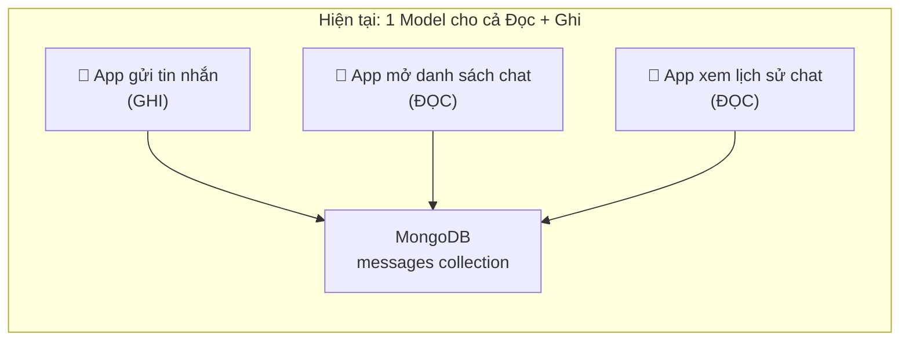
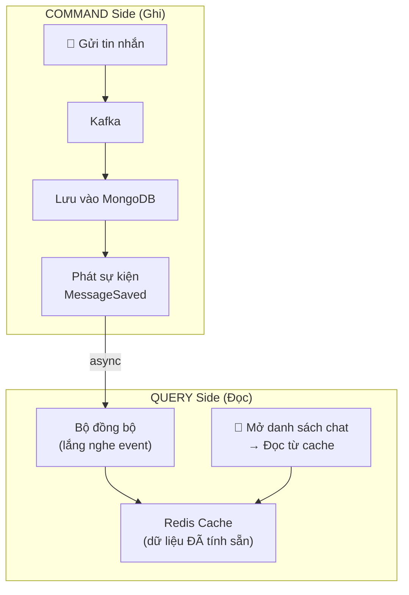

# 🧠 CQRS Giải Thích Chi Tiết Cho Người Mới

## 1. CQRS Là Gì?

**CQRS = Command Query Responsibility Segregation**
Dịch: **Tách biệt trách nhiệm giữa Ghi (Command) và Đọc (Query)**

Hãy tưởng tượng một **nhà hàng**:

```
🍳 BẾP (Command/Write)          📋 QUẦY ORDER (Query/Read)
─────────────────────           ─────────────────────────
• Nhận order                    • Xem menu
• Nấu món ăn                    • Xem trạng thái order
• Chuẩn bị nguyên liệu         • Xem lịch sử order cũ
                                
→ Cần tốc độ xử lý             → Cần truy vấn nhanh
→ Thay đổi dữ liệu             → Chỉ đọc dữ liệu
→ Xảy ra ÍT hơn                → Xảy ra NHIỀU hơn
```

> [!NOTE]
> **Ý tưởng cốt lõi:** Thay vì dùng CÙNG MỘT model/database cho cả đọc và ghi, ta TÁCH chúng ra thành 2 phần riêng biệt, mỗi phần được tối ưu cho mục đích riêng.

---

## 2. Dự Án IUH Connect Hiện Tại (KHÔNG có CQRS)

Hiện tại, dự án dùng **cùng 1 model** cho cả đọc và ghi:



### Vấn đề cụ thể trong code hiện tại

**Khi GHI (gửi tin nhắn)** — đơn giản, nhanh:

```java
// ChatMessageKafkaConsumer.java — Lưu 1 document, rất nhanh
entity = messageRepository.save(entity);  // ← Chỉ 1 dòng, ~2ms
```

**Khi ĐỌC (lấy danh sách conversation)** — phức tạp, chậm:

```java
// MessageService.java — Aggregation pipeline 6 bước, rất chậm!
Aggregation aggregation = Aggregation.newAggregation(
    match(...)      // Bước 1: Lọc tin nhắn của user
    sort(...)       // Bước 2: Sắp xếp theo thời gian  
    $group(...)     // Bước 3: Nhóm theo conversation + đếm unread
    $addFields(...) // Bước 4: Thêm unreadCount
    $unset(...)     // Bước 5: Xóa field thừa
    replaceRoot()   // Bước 6: Đổi cấu trúc document
    sort(...)       // Bước 7: Sắp xếp lại
);
// Pipeline này quét TOÀN BỘ messages collection → rất tốn CPU!
```

> [!WARNING]
> **Vấn đề:** Mỗi lần user mở app → gọi `getRecentConversations()` → MongoDB phải quét **hàng triệu documents** để tìm tin nhắn cuối cùng của mỗi cuộc trò chuyện + đếm tin chưa đọc. User càng nhiều → càng chậm.

---

## 3. Sau Khi Áp Dụng CQRS



### Luồng hoạt động:

**Bước 1 — GHI (không đổi):** User A gửi tin nhắn → Kafka → lưu MongoDB

**Bước 2 — CẬP NHẬT READ MODEL (mới):** Sau khi lưu xong, tự động cập nhật Redis:
```
Redis key: "conv_summary:userB"
Value: [
  { conversationId: "conv_123", lastMessage: "Hello!", 
    senderName: "UserA", timestamp: 1717000000, unreadCount: 3 },
  { conversationId: "conv_456", lastMessage: "Bye!", 
    senderName: "UserC", timestamp: 1716999000, unreadCount: 0 }
]
```

**Bước 3 — ĐỌC (siêu nhanh):** User B mở app → đọc từ Redis → **có ngay**, không cần aggregation!

---

## 4. Ví Dụ Code: Trước và Sau CQRS

### ❌ TRƯỚC (không CQRS) — Đọc chậm

```java
// Mỗi lần user mở app đều chạy aggregation phức tạp này
public List<ConversationSummaryDto> getRecentConversations(String username) {
    // 🐌 Quét hàng triệu documents mỗi lần!
    Aggregation aggregation = Aggregation.newAggregation(
        match(...),    // Lọc
        sort(...),     // Sắp xếp  
        group(...),    // Nhóm + đếm unread
        addFields(...),
        replaceRoot(...),
        sort(...)
    );
    return mongoTemplate.aggregate(aggregation, "messages", ...);
    // ⏱️ Thời gian: ~200-500ms (tùy data)
}
```

### ✅ SAU (có CQRS) — Đọc cực nhanh

**Phần Command (Ghi) — thêm 1 bước cập nhật cache:**

```java
// Sau khi lưu message vào MongoDB, cập nhật Read Model
@KafkaListener(topics = "chat-messages", groupId = "read-model-updater")
public void updateReadModel(ChatMessageDto message) {
    // 1. Lưu MongoDB (giữ nguyên)
    messageRepository.save(entity);
    
    // 2. MỚI: Cập nhật conversation summary trong Redis
    String key = "conv_summary:" + message.getReceiverId();
    ConversationSummary summary = ConversationSummary.builder()
        .conversationId(message.getConversationId())
        .lastMessage(message.getContent())
        .senderName(message.getSenderId())
        .timestamp(message.getTimestamp())
        .build();
    
    // Cập nhật summary + tăng unreadCount
    redisTemplate.opsForHash().put(key, message.getConversationId(), summary);
    redisTemplate.opsForHash().increment(
        "unread:" + message.getReceiverId(), 
        message.getConversationId(), 1
    );
}
```

**Phần Query (Đọc) — đơn giản hóa triệt để:**

```java
// Đọc từ Redis — cực nhanh, không cần aggregation!
public List<ConversationSummaryDto> getRecentConversations(String username) {
    String key = "conv_summary:" + username;
    Map<Object, Object> summaries = redisTemplate.opsForHash().entries(key);
    // ⏱️ Thời gian: ~1-2ms (nhanh hơn 100-500x!)
    
    return summaries.values().stream()
        .map(this::toDto)
        .sorted(Comparator.comparingLong(ConversationSummaryDto::getTimestamp).reversed())
        .collect(Collectors.toList());
}
```

---

## 5. So Sánh Hiệu Suất

| Thao tác | Không CQRS | Có CQRS |
|----------|-----------|---------|
| Gửi tin nhắn (GHI) | ~5ms | ~7ms *(chậm hơn chút vì cập nhật cache)* |
| Mở danh sách chat (ĐỌC) | **~200-500ms** | **~1-2ms** ⚡ |
| Xem lịch sử (ĐỌC) | ~50ms | ~50ms *(giữ nguyên)* |
| Đánh dấu đã đọc (GHI) | ~100ms | ~5ms |

> [!TIP]
> **Tại sao cải thiện lớn?** Vì trong chat app, **đọc xảy ra NHIỀU hơn ghi rất nhiều.** Mỗi lần mở app = 1 lần đọc danh sách. Nhưng gửi tin nhắn thì ít hơn. CQRS tối ưu đúng chỗ cần thiết.

---

## 6. Khi Nào NÊN và KHÔNG NÊN Dùng CQRS

### ✅ NÊN dùng khi:
- **Đọc >> Ghi** (chat list mở liên tục, nhưng gửi tin nhắn thỉnh thoảng)
- **Query phức tạp** (aggregation pipeline như `getRecentConversations`)
- **Cần scale đọc riêng** (thêm Redis replica cho read, không ảnh hưởng write)

### ❌ KHÔNG nên dùng khi:
- App đơn giản, ít data
- Đọc và ghi tần suất bằng nhau
- Team nhỏ, không muốn tăng complexity

---

## 7. Tóm Tắt Bằng Hình Ảnh

```
╔══════════════════════════════════════════════════════════╗
║                    CQRS TÓM TẮT                         ║
║                                                          ║
║   📝 COMMAND (Ghi)          📖 QUERY (Đọc)              ║
║   ─────────────             ─────────────                ║
║   • Gửi tin nhắn            • Xem danh sách chat         ║
║   • React emoji             • Xem lịch sử tin nhắn       ║
║   • Đánh dấu đã đọc        • Đếm tin chưa đọc           ║
║                                                          ║
║   Lưu vào: MongoDB          Đọc từ: Redis Cache          ║
║   Tối ưu: Consistency       Tối ưu: Tốc độ               ║
║                                                          ║
║          MongoDB ──(event)──→ Redis (tự đồng bộ)         ║
╚══════════════════════════════════════════════════════════╝
```

> [!IMPORTANT]
> **Một câu tóm tắt:** CQRS = *"Ghi vào nơi an toàn (MongoDB), đọc từ nơi nhanh nhất (Redis). Hai bên tự đồng bộ với nhau qua events."*
