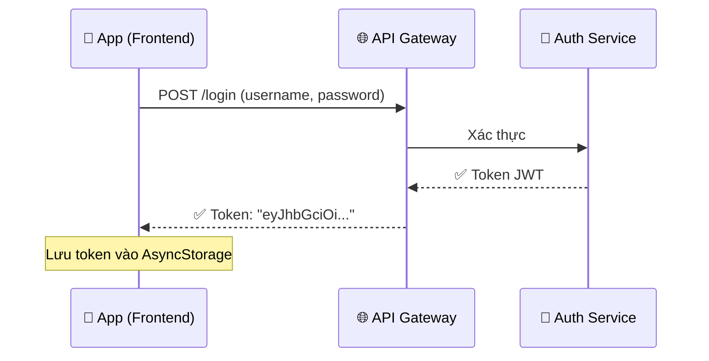
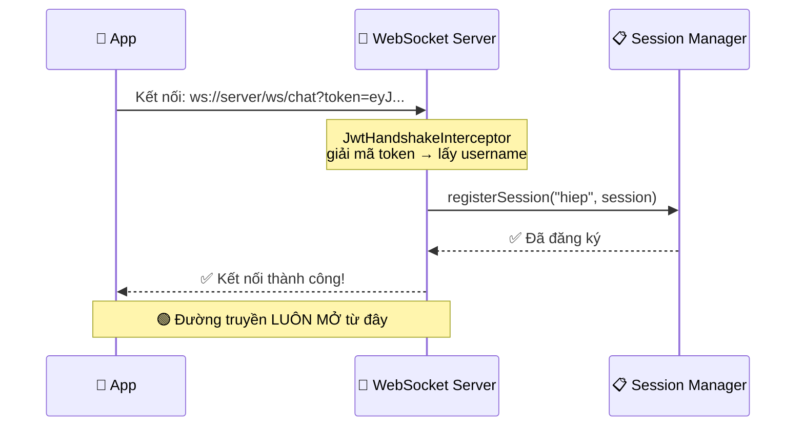
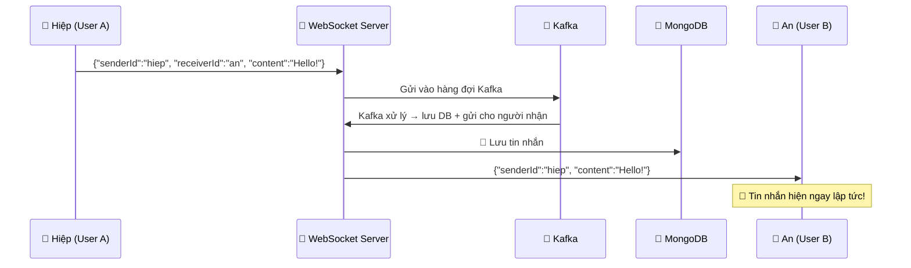
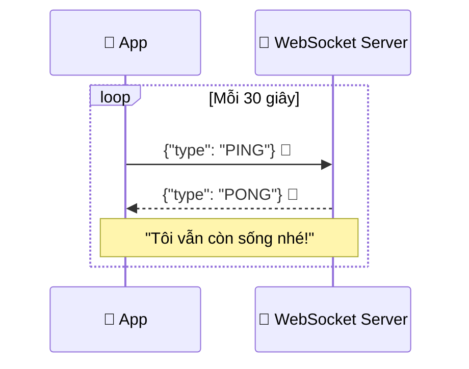
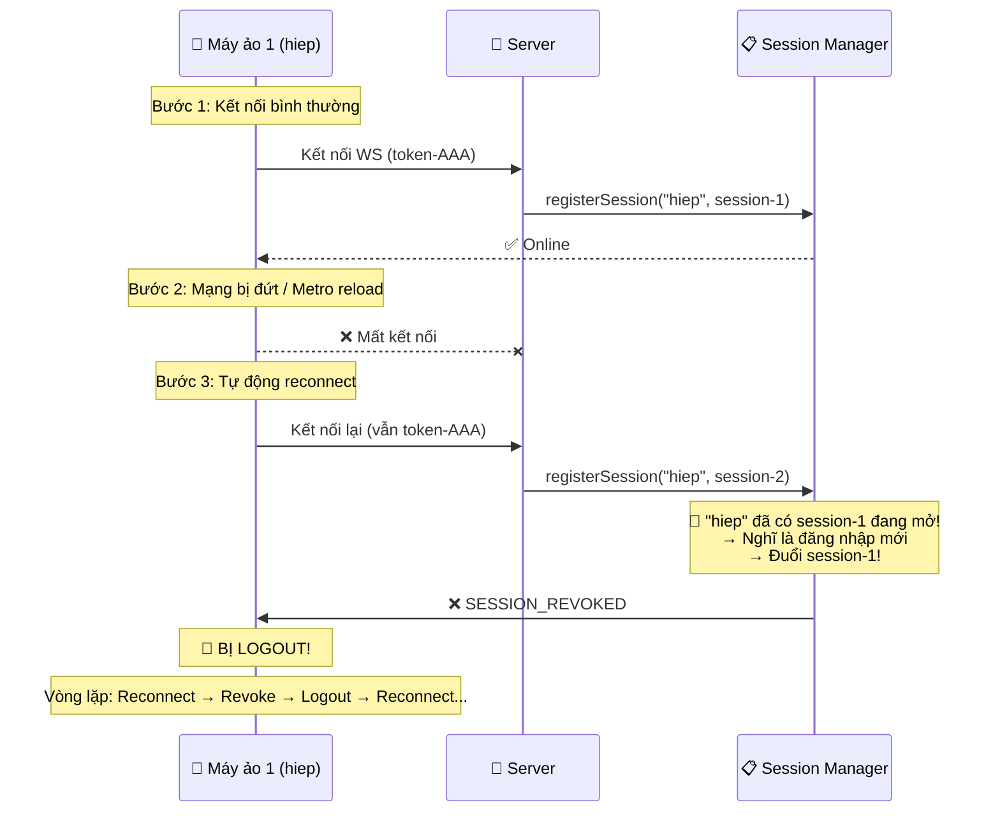
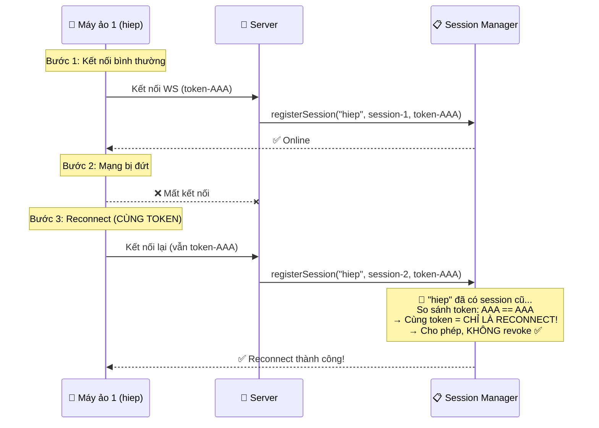
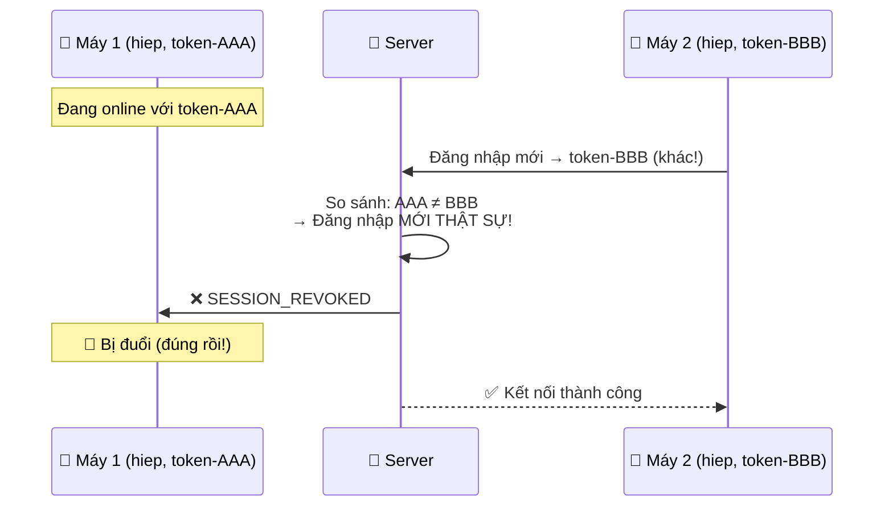

# WebSocket là gì? Giải thích cho người mới 🧑‍🎓

## 1. HTTP vs WebSocket — Ví dụ đời thường

### 📞 HTTP giống như gọi điện thoại cho nhà hàng:

> Mỗi lần bạn muốn hỏi "Đồ ăn xong chưa?", bạn phải:
> 1. Bấm số → Chờ kết nối
> 2. Hỏi "Xong chưa?"
> 3. Nhà hàng trả lời "Chưa"
> 4. **Cúp máy**
> 5. 5 phút sau lại gọi lại... lặp lại từ bước 1

👉 **Mỗi lần hỏi = 1 kết nối mới** → Tốn thời gian, chậm

### 🔌 WebSocket giống như mở loa ngoài 2 chiều:

> Bạn gọi nhà hàng **1 lần duy nhất**, rồi **KHÔNG CÚP MÁY**:
> - Bạn hỏi bất cứ lúc nào: "Xong chưa?"
> - Nhà hàng cũng **chủ động** báo cho bạn: "Đồ ăn xong rồi!"
> - Đường truyền **luôn mở** cho đến khi ai đó cúp máy

👉 **1 kết nối duy nhất, 2 chiều, real-time** → Nhanh, tiết kiệm

---

## 2. Tại sao Chat cần WebSocket?

```
❌ Dùng HTTP cho chat:
   Bạn phải liên tục hỏi server: "Có tin nhắn mới không?" (mỗi 1-2 giây)
   → Tốn tài nguyên, chậm, không real-time

✅ Dùng WebSocket cho chat:
   Kết nối 1 lần → Server TỰ ĐỘNG gửi tin nhắn mới cho bạn ngay lập tức
   → Nhanh, tiết kiệm, real-time như Zalo/Messenger
```

---

## 3. Luồng WebSocket trong dự án IUH Connect

### Bước 1: Đăng nhập



> **Token JWT** giống như "thẻ vào cổng" — chứng minh bạn là ai

### Bước 2: Kết nối WebSocket



### Bước 3: Gửi & Nhận tin nhắn (Real-time)



> **Không cần User B hỏi** "Có tin nhắn mới không?" — Server **tự động đẩy** xuống!

### Bước 4: Heartbeat (Giữ kết nối sống)



> Giống như nói **"Alô? Bạn còn đó không?"** mỗi 30 giây để đường dây không bị cúp

---

## 4. Vấn đề SESSION_REVOKED — Tại sao bị logout?

### Session Manager là gì?

Tưởng tượng **Session Manager là cuốn sổ** ghi ai đang online:

```
📋 Cuốn sổ (Session Manager):
┌──────────┬───────────────┐
│ Username │ Kết nối (WS)  │
├──────────┼───────────────┤
│ hiep     │ session-ABC   │
│ an       │ session-XYZ   │
└──────────┴───────────────┘
```

> **Quy tắc cũ**: Mỗi người CHỈ ĐƯỢC 1 kết nối. Nếu có kết nối mới → đuổi kết nối cũ.

### Lỗi xảy ra như thế nào (TRƯỚC KHI SỬA):



### SAU KHI SỬA:



### Khi nào MỚI revoke? (Đăng nhập thật sự từ nơi khác)



---

## 5. Tóm tắt kiến thức

| Khái niệm | Giải thích đơn giản |
|-----------|---------------------|
| **HTTP** | Gọi điện → hỏi → trả lời → cúp máy (1 chiều, nhiều lần) |
| **WebSocket** | Mở loa ngoài 2 chiều, luôn bật (real-time) |
| **Token JWT** | "Thẻ vào cổng" chứng minh bạn là ai |
| **Session** | 1 kết nối WebSocket đang mở = 1 session |
| **Session Manager** | "Cuốn sổ" ghi ai đang online, kết nối nào |
| **Heartbeat (PING/PONG)** | "Alô bạn còn đó không?" mỗi 30 giây |
| **Reconnect** | Tự kết nối lại khi mạng đứt |
| **SESSION_REVOKED** | Bị đuổi vì có người khác đăng nhập cùng tài khoản |
| **Kafka** | Hàng đợi tin nhắn — đảm bảo không mất tin khi hệ thống bận |
| **MongoDB** | Database lưu trữ tất cả tin nhắn |

### Luồng tổng quan trong IUH Connect:

```
📱 App → 🔐 Login → 🎫 Nhận Token
                        ↓
              🔌 Kết nối WebSocket (dùng Token)
                        ↓
              📋 Session Manager ghi nhận online
                        ↓
         ┌──────────────┼──────────────┐
         ↓              ↓              ↓
    💬 Chat        📞 Video Call   👥 Presence
   (gửi/nhận)     (tín hiệu)    (online/offline)
         ↓              
    📨 Kafka → 💾 MongoDB (lưu tin nhắn)
```
