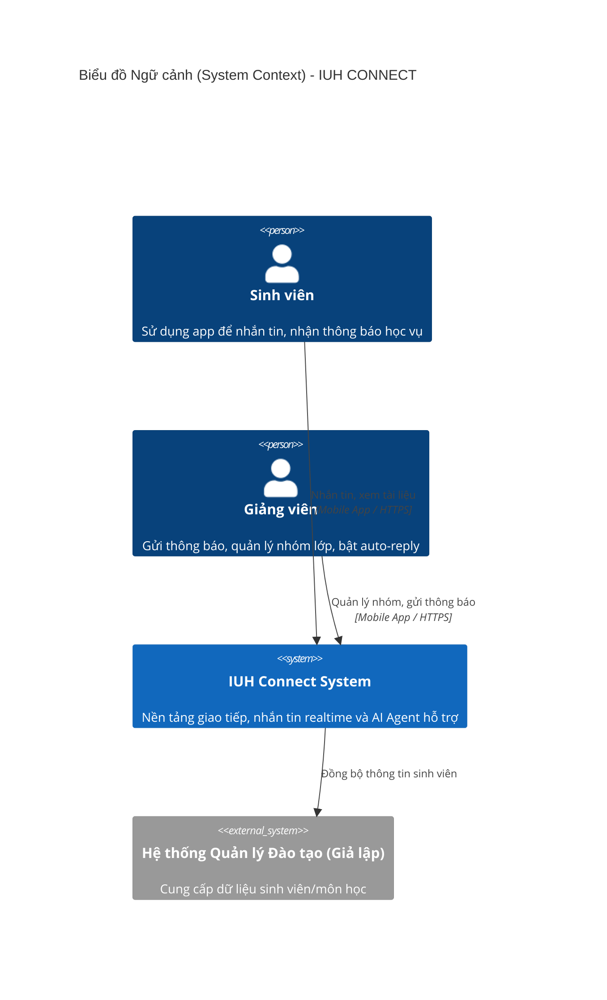
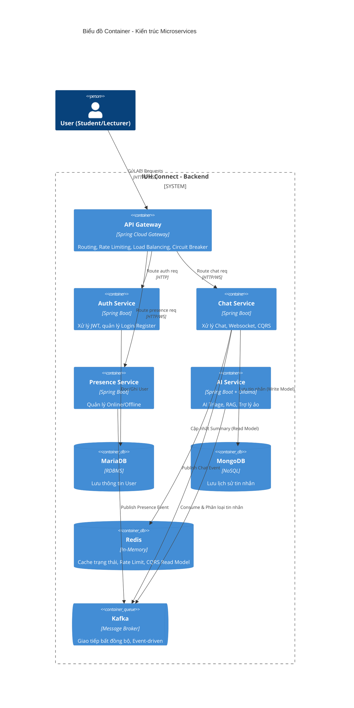

# Hướng Dẫn Bảo Vệ Đồ Án Môn Học: Software Architecture and Design (Bản Chi Tiết Nâng Cao)

Tài liệu này cung cấp **kịch bản trả lời vấn đáp chi tiết từng chữ**, sơ đồ kiến trúc chuẩn mực, và hướng dẫn từng bước để bạn tự tin đạt điểm tối đa (10/10) với giảng viên.

---

## 1. Project Organization (Tổ chức dự án) - 1 Điểm

### 1.1. Link Gitlab/Github (0.25đ)
- **Kịch bản trả lời thầy:** *"Thưa thầy, nhóm em sử dụng Github để quản lý source code (repository `Hiep0718/IUH_CONNECT`). Tụi em thống nhất áp dụng chuẩn Conventional Commits. Các commit luôn bắt đầu bằng `feat:` (thêm chức năng), `fix:` (sửa lỗi), hoặc `refactor:` (tái cấu trúc). Điều này giúp việc review code và dò tìm lỗi dễ dàng hơn rất nhiều. Code được chia thành thư mục `frontend` và `backend` riêng biệt để dễ quản lý."*

### 1.2. Agile - Scrum (0.5đ)
- **Phương án triển khai chi tiết:** Bạn hãy lên **Trello.com**, tạo một bảng (Board) tên là "IUH_CONNECT Scrum Board" và tạo các cột: `Product Backlog`, `Sprint Backlog`, `In Progress`, `Reviewing`, `Done`.
- **Ví dụ đưa vào Trello để thầy xem:**
  - **Sprint 1 (Nền tảng & User):** Task "Thiết kế CSDL MariaDB", Task "Làm Auth Service bảo mật JWT", Task "Xây dựng API Gateway".
  - **Sprint 2 (Core Chat):** Task "Thiết lập Kafka & Zookeeper", Task "Code Chat Service dùng Websocket", Task "Lưu trữ tin nhắn vào MongoDB".
  - **Sprint 3 (Tối ưu & AI):** Task "Áp dụng CQRS bằng Redis", Task "Code AI Service phân loại tin nhắn khẩn cấp", Task "Viết file docker-compose".
- **Kịch bản trả lời thầy:** *"Nhóm em quản lý dự án theo mô hình Scrum. Cứ mỗi 2 tuần là 1 Sprint. Ở đầu mỗi Sprint, tụi em họp Planning để bốc task từ Product Backlog sang Sprint Backlog. Tụi em dùng Trello để track tiến độ (chỉ vào Trello). Mỗi khi code xong 1 task, code sẽ được đẩy lên Github để các bạn khác pull về test."*

### 1.3. Functions (0.25đ)
- **Kịch bản trả lời thầy:** *"Dự án IUH_CONNECT của bọn em tập trung giải quyết bài toán giao tiếp nội bộ trong trường học, với 5 module chức năng chính: (1) Xác thực và Quản lý người dùng, (2) Chat Realtime (1-1 và Group), (3) Quản lý trạng thái Online/Offline Realtime, (4) Chia sẻ tài liệu & ảnh (S3/MinIO), và đặc biệt nhất là (5) Ứng dụng AI Agent để tự động phân tích độ khẩn cấp của tin nhắn."*

---

## 2. Architecture Styles (Kiến trúc hệ thống) - 3 Điểm

### 2.1. C4 Model & System Design Diagram (1.25đ)

Dưới đây là mã Mermaid để bạn có thể copy vào [Mermaid Live Editor](https://mermaid.live/) và xuất ra ảnh chèn vào báo cáo.

#### Biểu đồ Context (Mức độ 1)

#### Biểu đồ Container (Mức độ 2)

### 2.2. So sánh Kiến trúc (Trade-offs & Monolith vs Microservices) (0.75đ)

- **Kịch bản trả lời thầy:**
  - *"Thưa thầy, nếu làm **Monolith (kiến trúc nguyên khối)**, tất cả code nhét chung một chỗ, database dùng chung. Ưu điểm là code nhanh, dễ deploy. Nhưng khi hệ thống gặp tải cao ở chức năng Chat, toàn bộ ứng dụng (kể cả Auth) sẽ sụp đổ theo. Hơn nữa, nếu code lỗi rò rỉ bộ nhớ ở Chat, toàn server sẽ chết."*
  - *"Vì vậy nhóm em chọn **Microservices**. Lợi ích lớn nhất là tính **Cô lập (Isolation)** và **Scale độc lập**. Nếu AI Service bị quá tải do GPU yếu, hệ thống Chat vẫn chạy bình thường, Gateway sẽ dùng Circuit Breaker để trả về thông báo 'AI đang bảo trì' thay vì làm treo toàn bộ App."*
  - *"Sự đánh đổi (Trade-off) ở đây là gì? Đó là **Tính nhất quán dữ liệu (Data Consistency)**. Khi một tin nhắn được gửi đi, nó được ném vào Kafka. Có thể mất vài mili-giây để Notification Service đọc được và gửi Push Noti. Nhóm chấp nhận tính **Eventual Consistency** (nhất quán cuối cùng) để đạt được **Hiệu năng cực cao (High Availability)**."*

### 2.3. Câu hỏi tình huống (1.0đ)
Dưới đây là các câu hỏi thầy Tiến rất hay hỏi để "xoáy" sinh viên:

- **Hỏi:** *Nếu Server đang chạy mà mất điện chết ngang 1 service (ví dụ Chat), điều gì xảy ra với các request đang tới?*
  - **Đáp:** *"API Gateway của tụi em có cấu hình thư viện **Resilience4j Circuit Breaker**. Nếu Chat Service chết, thay vì Gateway cứ chờ (timeout) làm nghẽn toàn bộ luồng, Circuit Breaker sẽ **Mở mạch (Open State)** và gọi hàm `FallbackController`. Người dùng sẽ nhận được mã lỗi 503 thân thiện ('Hệ thống chat đang bảo trì'). Đồng thời, Docker Swarm sẽ dùng cơ chế `healthcheck` phát hiện container chết và tự động `Restart` lại nó."*

- **Hỏi:** *Tại sao lại dùng Kafka? Gọi thẳng HTTP Rest (RestTemplate/FeignClient) giữa các service không được sao?*
  - **Đáp:** *"Nếu gọi HTTP, 2 service bị **Coupling (Ràng buộc chặt)**. Nếu Notification chết, Chat gọi sang sẽ bị báo lỗi và user không gửi được tin nhắn. Bằng cách dùng Kafka, Chat Service chỉ việc ném tin nhắn vào Topic `chat-messages` rồi báo 'Thành công' cho user. Notification sống lại lúc nào thì tự vào Kafka đọc tiếp lúc đó. Tránh mất mát dữ liệu và giảm độ trễ API."*

---

## 3. Architecture Characteristics (Đặc điểm kiến trúc) - 3 Điểm

### 3.1. Performance & Tối ưu hoá (Redis CQRS)
- **Kịch bản trả lời:** *"Để load danh sách đoạn chat (như Messenger), nếu dùng SQL hay Mongo thì phải group, sort, count rất nặng. Em đã tách riêng đường Đọc (Read) và Ghi (Write) bằng **CQRS**. Ghi thì vào MongoDB, nhưng sau khi ghi xong, một Kafka Consumer ngầm sẽ update dữ liệu tóm tắt (Conversation Summary) vào **Redis**. Khi User mở app, API Gateway chọc thẳng vào Redis đọc danh sách chat chưa tới 10ms. Nhanh hơn hàng trăm lần."*

### 3.2. Fault Tolerance - Xử lý chịu lỗi (Rate Limiter)
- **Kịch bản trả lời:** *"Để bảo vệ hệ thống khỏi các cuộc tấn công DDoS hoặc sinh viên xài bot spam tin nhắn, em cấu hình **RequestRateLimiter** trong Spring Cloud Gateway kết hợp thuật toán Token Bucket của Redis. API Login bị giới hạn khắt khe (3 request/giây) dựa trên IP. Các API Chat thì giới hạn cao hơn (100 req/giây) nhưng dựa trên Username trong JWT Token để đảm bảo công bằng tài nguyên."*

### 3.3. Idempotency (Chống trùng lặp)
- **Kịch bản trả lời:** *"Khi mạng lag, sinh viên có thể bấm nút Gửi 2 lần, hoặc Kafka retry gửi bản tin. Em áp dụng **Idempotency** bằng lệnh `SETNX` của Redis. Ở API Gateway có `HttpIdempotencyFilter`, nó khóa các request trùng lặp (dựa vào `X-Idempotency-Key` từ Client) trong vòng 10 giây, chặn đứng lỗi lưu trùng tin vào Database."*

---

## 4. DevOps - 1.5 Điểm

### 4.1. Clean Architecture & Strategy Pattern
- **Kịch bản trả lời:** *"Về Maintainability (Bảo trì code), ở Chat Service, thay vì viết một class Websocket dài ngàn dòng chứa toàn lệnh `if-else` để xử lý các loại tin nhắn (CHAT, PING, READ_RECEIPT), em đã cấu trúc lại theo **Strategy Pattern**. Nhờ Spring Dependency Injection, mỗi loại tin nhắn là một class xử lý độc lập. Khi muốn thêm tính năng Video Call, dev chỉ cần viết thêm 1 class mới mà không sợ làm hỏng code cũ (tuân thủ Open/Closed Principle)."*

### 4.2. Hướng dẫn Tự Deploy (Để lấy điểm tuyệt đối phần này)
Để trình diễn cho thầy xem hệ thống thực sự chạy trên mạng, bạn cần làm theo các bước sau trước ngày bảo vệ:
1. Đăng ký một tài khoản máy chủ ảo (VPS) (Ví dụ: DigitalOcean, AWS EC2, Google Cloud, hoặc thuê 1 con VPS VN giá rẻ 100k/tháng). Yêu cầu: RAM tối thiểu 4GB (do chạy cả Kafka, Mongo, Redis).
2. SSH vào VPS và cài Docker + Docker Compose.
3. Clone code của bạn về VPS: `git clone https://github.com/Hiep0718/IUH_CONNECT`
4. Di chuyển vào thư mục: `cd IUH_CONNECT`
5. Khởi động toàn bộ: `docker compose up -d`
6. Cho thầy xem IP public hoặc domain (nếu có). *"Thưa thầy, bọn em không chạy localhost mà đã deploy toàn bộ 10 container này lên Cloud Server thông qua Docker Compose. App điện thoại hiện tại đang kết nối trực tiếp với Server thực tế."*

*(Nếu bạn cần script Github Actions để mỗi lần Push code tự động deploy lên VPS, hãy báo tôi, tôi sẽ viết file `.github/workflows/deploy.yml` cho bạn).*

---

## 5. AI Agent - 1.5 Điểm (Điểm Sáng Nhất)

Đây là chức năng sẽ khiến đồ án của bạn khác biệt hoàn toàn với các đồ án chỉ có CRUD thông thường. Bạn hãy "khoe" nó thật mạnh.

- **Kịch bản trả lời:** 
  - *"Thưa thầy, hệ thống của em không chỉ là chat thông thường, mà có tích hợp **AI Agent Tự Động**. Em xây dựng riêng một `ai-service` chạy song song."*
  - *"**Workflow 1 (AI Triage):** Mọi tin nhắn trong nhóm lớp (ví dụ lớp vài trăm người) đều được ném vào Kafka. Consumer `AiTriageKafkaConsumer` của em sẽ đọc ngầm. Nó dùng Luật (Rule) để bắt các từ khoá (deadline, nghỉ học). Sau đó, nó đưa câu đó cho AI (Ollama Local) phán đoán mức độ URGENCY (Khẩn cấp). Nếu AI chấm là 'HIGH', hệ thống mới đẩy Push Notification ưu tiên, giúp sinh viên không bị trôi tin nhắn quan trọng giữa hàng ngàn tin chat chit."*
  - *"**Workflow 2 (RAG):** AI Service có tích hợp CSDL Vector (ChromaDB) chứa thông tin quy chế đào tạo IUH. Khi sinh viên hỏi, hệ thống sẽ trích xuất (Retrieve) luật từ ChromaDB đút vào Prompt cho LLM trả lời, khắc phục hoàn toàn lỗi ảo giác (Hallucination) của AI."*
  - *"Nhờ chạy Microservices, con AI này (ngốn nhiều CPU/RAM) nằm tách biệt, nếu nó quá tải cũng không làm lag ứng dụng chat của người dùng."*

---

> **Tóm lại để đạt điểm 10:** Hãy tập trung nhấn mạnh vào chữ **"Sự đánh đổi (Trade-off)"**, các mẫu thiết kế giải quyết vấn đề hiệu năng cao (**Kafka, CQRS, Redis, Rate Limiter**), và tính năng tự động của **AI Agent**. Mã nguồn của bạn hiện tại đã hội tụ đủ các tinh hoa kiến trúc chuẩn doanh nghiệp. Chúc bạn bảo vệ thành công!
